<!--
  ~ Copyright (C) 2025 Enedis Smarties team <dt-dsi-nexus-lab-smarties@enedis.fr>
  ~ 
  ~ SPDX-FileContributor: Jehan BOUSCH
  ~ 
  ~ SPDX-License-Identifier: Apache-2.0
-->

# Software Architecture

## Introduction

### Document Purpose

The purpose of this document is to document the architecture of the **tic4eebus** application.

### Application Scope

The **tic4eebus** application allows limiting an electric vehicle (EV) charging station based on the available energy provided by a Linky meter.

The software implements the OPEV use case of the EEBUS standard by acting as an energy management system (Energy Guard) to control the EV charging station (CEM) based on data read from the Linky meter (Smart Meter).

## Architecture Overview

### General Description

#### Use Case

The **tic4eebus** application interacts with five actors:

- The **_Clock_** triggering energy management system functionalities
- The **_File System_** storing application data
- The **_Database_** providing access to application data
- The **_[TIC2WebSocket](https://github.com/Enedis-OSS/TIC2WebSocket) API_** providing metrological data from the Linky meter
- The **_[EEBUS Stack](https://github.com/enbility/eebus-go)_** managing access to the charging station and electric vehicle

The **_Clock_** actor allows:

- Triggering the available energy adjustment

The **_File System_** actor allows:

- Storing application business data

The **_Database_** actor allows:

- Accessing application business data (visualization, processing, etc.)

The **_TIC2WebSocket API_** actor allows:

- Receiving Linky meter data

The **_EEBUS Stack_** actor allows:

- Limiting electric vehicle charging

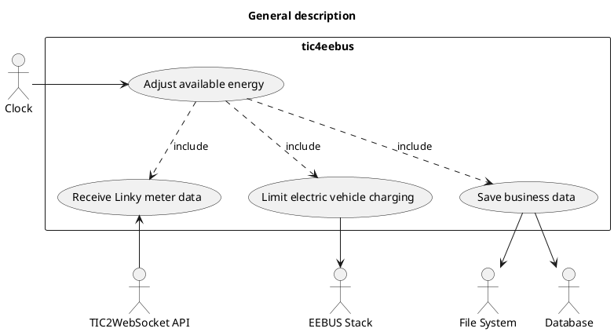

### Main Components

The **tic4eebus** application contains:

- The **_main_** component hnadling program startup and shutdown
- The **_config_** component loading all application configurations
- The **_ems_** component containing the application's energy management system
- The **_ems.data_** component managing the application's data model
- The **_linkymeter_** component receiving Linky meter data
- The **_evse_** component providing access to the charging station and electric vehicle

It uses two main external dependencies:

- The **_[TIC2WebSocket](https://github.com/Enedis-OSS/TIC2WebSocket)_** component receiving frames from the meter customer interface (TIC)
- The **_[eebus-go](https://github.com/enbility/eebus-go)_** component enabling EEBUS communication with equipment (charging station and vehicle)

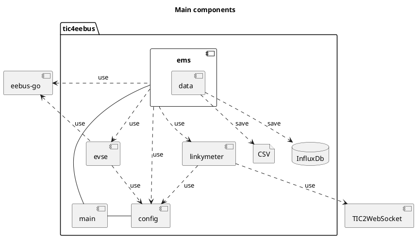

## Detailed Architecture View

### main component

#### Description

The **_main_** component is responsible for launching and stopping the program.

At startup, it manages:

- Command line interpretation (function **_main.parseCommandLine_**)
- Configuration loading (function **_config.LoadConfig_**)
- Logger initialization (function **_main.initLogger_**)
- Energy management system startup (method **_Start_** of class **_ems.EnergyGuard_**)

At shutdown, it manages:

- Energy management system shutdown (method **_Stop_** of class **_ems.EnergyGuard_**)

#### Dependencies

##### Internal Dependencies

The **_main_** module uses 2 internal dependencies:

1. The **_config_** module
2. The **_ems_** module

##### External Dependencies

The main module uses 2 external dependencies:

1. The **_[file-rotatelogs](https://github.com/lestrrat-go/file-rotatelogs)_** package for log rotation
2. The **_[logrus](https://github.com/sirupsen/logrus)_** package for log management

#### Class Diagram

The following class diagram describes the **_main_** component and its internal dependencies:

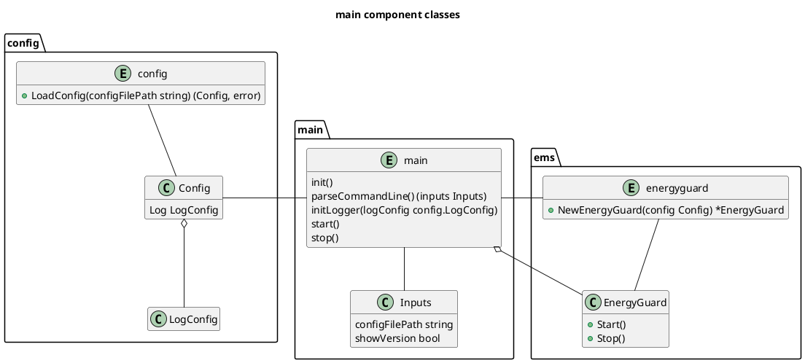

### config component

#### Description

The **_config_** component is responsible for loading all application configurations.

It uses:

- The configuration for the overload protection algorithm implementing the OPEV use case of the EEBUS standard (class **_config.OverloadProtectionConfig_**)
- The electric vehicle data access configuration (class **_config.VehicleConfig_**)
- The charging station data access configuration (class **_config.WallboxConfig_**)
- The application logging configuration (class **_config.LogConfig_**)
- The application data model persistence configuration (class **_config.DataModelConfig_**)
- The Linky meter TIC access configuration (class **_config.TeleInformationClientConfig_**)
- The EEBUS communication configuration (class **_config.EEBUSConfig_**)

#### Dependencies

##### Internal Dependencies

The **_config_** module has no internal dependencies.

##### External Dependencies

The **_config_** module uses 2 external dependencies:

1. The **_[logrus](https://github.com/sirupsen/logrus)_** package to use the desired logging level
2. The **_[yaml](https://github.com/go-yaml/yaml)_** package to decode YAML configuration file

#### Class Diagram

The following class diagram describes the **_config_** component and its internal dependencies:

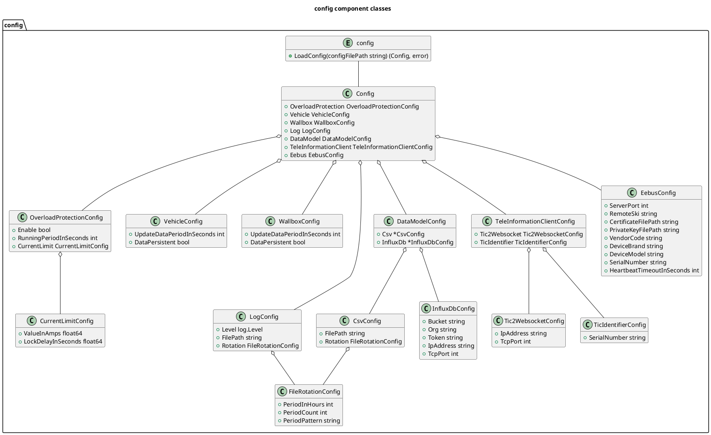

### linkymeter component

#### Description

The linkymeter component is responsible for accessing Linky meter data.

It manages:

- Access to the interface (websocket server) provided by the TIC2WebSocket application (class **_linkymeter.TIC2WebSocketClient_**)
- Retrieving meter data from messages sent by TIC2WebSocket (function **_linkymeter.ComputeMeterData_**)

#### Dependencies

##### Internal Dependencies

The **_linkymeter_** module uses no internal dependencies.

##### External Dependencies

The linkymeter module uses 4 external dependencies:

1. The **_[uuid](https://github.com/google/uuid)_** package for generating unique identifiers used for meter subscription with the TIC2WebSocket application
2. The **_[websocket](https://github.com/gorilla/websocket)_** package for managing the websocket client accessing the TIC2WebSocket application
3. The **_[mapstructure](https://github.com/mitchellh/mapstructure)_** package for converting dictionaries to data structures
4. The **_[logrus](https://github.com/sirupsen/logrus)_** package for application logging

#### Class Diagram

The following class diagram describes the **_linkymeter_** component and its internal dependencies:

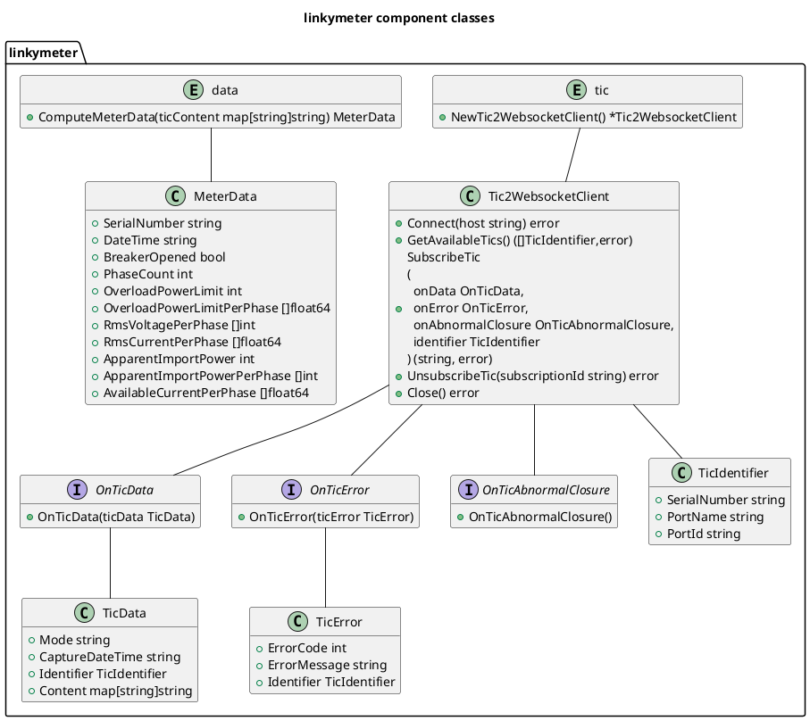

### evse component

#### Description

The **_evse_** component is responsible for reading charging station and electric vehicle data.

It uses:

- The charging station configuration (class **_config.WallboxConfig_**)
- The electric vehicle configuration (class **_config.VehicleConfig_**)
- The charging station component handling EEBUS messages related to the station (class **_evse.Wallbox_**)
- The electric vehicle component handling EEBUS messages related to the vehicle (class **_evse.Vehicle_**)

#### Dependencies

##### Internal Dependencies

The **_evse_** module uses 1 internal dependency:

- The config module

##### External Dependencies

The evse module uses 5 external dependencies:

1. The **_[eebus-go](https://github.com/enbility/eebus-go)_** package for the EEBUS service and EEBUS use cases (EVSECC, EVCC, EVCEM, OPEV)
2. The **_[spine-go](https://github.com/enbility/spine-go)_** package for accessing EEBUS equipment and entities for information retrieval (station operational state, EV communication standard, EV limitation result)
3. The **_[gocron](https://github.com/go-co-op/gocron)_** package for launching periodic tasks to read EV and charging station information
4. The **_[uuid](https://github.com/google/uuid)_** package for unique subscription identifier to EV and charging station information
5. The **_[logrus](https://github.com/sirupsen/logrus)_** package for application logging concerning the EV and charging station

#### Class Diagram

The following class diagram describes the synchronizer component and its internal dependencies:

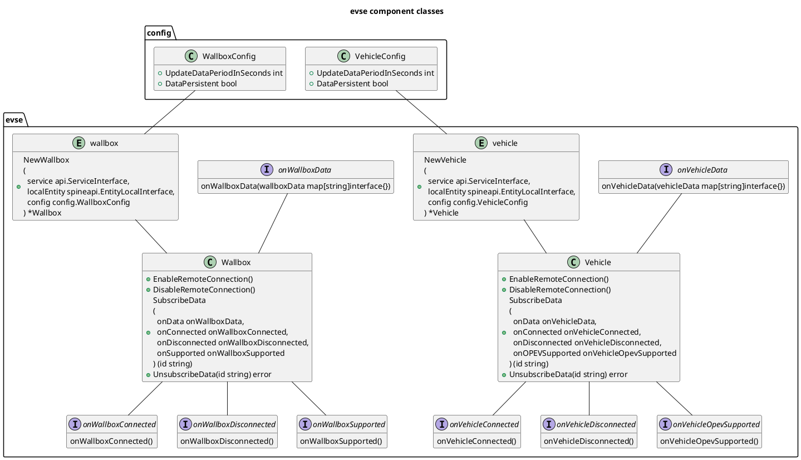

### ems component

#### Description

The **_ems_** component implements the energy management system called Energy Guard in the EEBUS standard.

It uses:

- The global application configuration (class **_config.Config_**)
- The TIC2WebSocket client to receive Linky meter data (class **_linkymeter.Tic2WebSocketClient_**)
- The conversion of raw Linky meter data to business data (function **_linkymeter.ComputeMeterData_**)
- Application data persistence (class **_ems.data.DataSynchronizer_**)
- Electric vehicle data retrieval (class **_evse.Vehicle_**)
- Charging station data retrieval (class **_evse.Wallbox_**)

#### Dependencies

##### Internal Dependencies

The **_ems_** component uses 4 internal dependencies:

1. The **_config_** package
2. The **_linkymeter_** package
3. The **_evse_** package
4. The **_ems.data_** package

##### External Dependencies

The ems component uses 7 external dependencies:

1. The **_[eebus-go](https://github.com/enbility/eebus-go)_** package for EEBUS service management and energy management system diagnostics
2. The **_[ship-go](https://github.com/enbility/ship-go)_** package for remote EEBUS service definition and remote connection state
3. The **_[spine-go](https://github.com/enbility/spine-go)_** package for local EEBUS entity interface and EV current limit setpoint write result information
4. The **_[gocron](https://github.com/go-co-op/gocron)_** package for launching the periodic EV charge limitation regulation task
5. The **_[cmp](https://github.com/google/go-cmp)_** package to detect changes in EV and charging station information
6. The **_[uuid](https://github.com/google/uuid)_** package for unique subscription identifier to energy management system information
7. The **_[logrus](https://github.com/sirupsen/logrus)_** package for application logging concerning the energy management system

#### Class Diagram

The following class diagram describes the ems component and its internal dependencies:

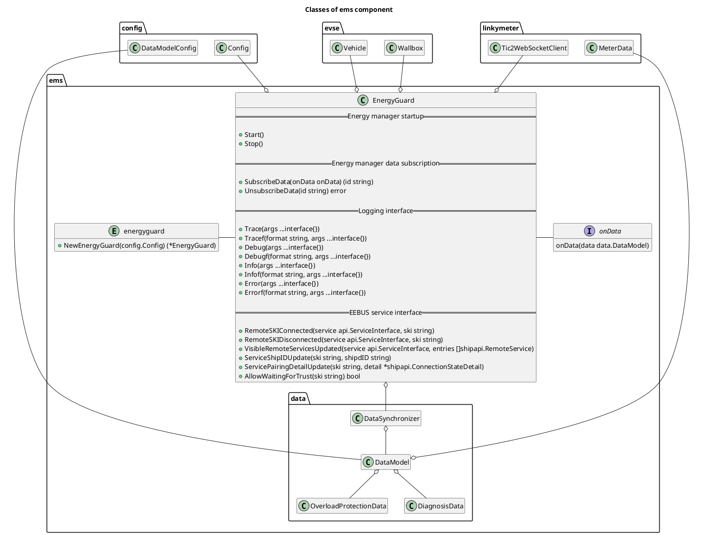

### ems.data component

#### Description

The **_ems.data_** component saves the application's [data model](data_model.md).

It uses:

- The application data model configuration (class **_config.DataModelConfig_**)
- The application data model (class **_ems.data.DataModel_**)
- The data model management interface (class **_ems.data.DataSynchronizer_**)
- The data model CSV file persistence interface (class **_ems.data.CsvWriter_**)
- The data model InfluxDb database persistence interface (class **_ems.data.InfluxDbWriter_**)

#### Dependencies

##### Internal Dependencies

The **_ems_** component uses 3 internal dependencies:

1. The **_config_** package
2. The **_linkymeter_** package
3. The **_evse_** package

##### External Dependencies

The ems component uses 6 external dependencies:

1. The **_[eebus-go](https://github.com/enbility/eebus-go)_** package for data types related to the electric vehicle and charging station
2. The **_[spine-go](https://github.com/enbility/spine-go)_** package for data types related to diagnostics, EV charge limitation, and charging station operational state
3. The **_[influxdb-client-go](https://github.com/influxdata/influxdb-client-go)_** package for InfluxDb database access
4. The **_[cmp](https://github.com/google/go-cmp)_** package to compare new EV and charging station data with current data
5. The **_[file-rotatelogs](https://github.com/lestrrat-go/file-rotatelogs)_** package for CSV file rotation
6. The **_[logrus](https://github.com/sirupsen/logrus)_** package for application logging concerning the data model

#### Class Diagram

The following class diagram describes the ems.data component and its internal dependencies:

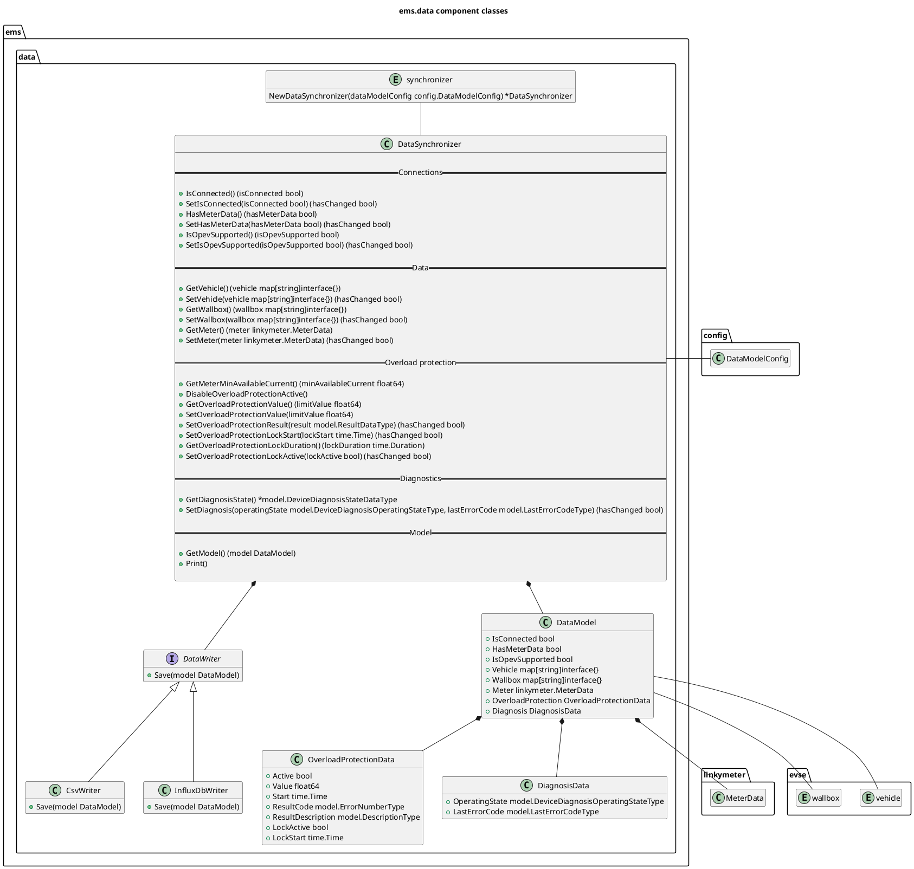

## Interaction Models

### Sequence Diagrams

The sequence diagrams illustrate interactions between components concerning:

- Application startup
- Application shutdown
- Energy management system startup
- Energy management system shutdown
- Energy management system periodic regulation

#### Application Startup

Application startup is described by the following sequence diagram:

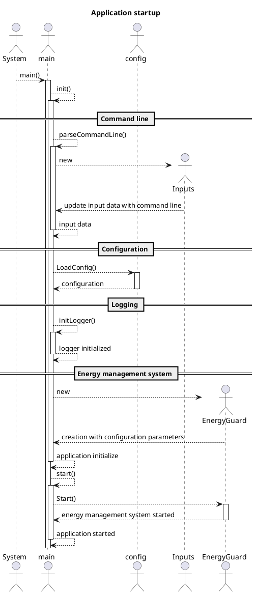

#### Application Shutdown

Application shutdown is described by the following sequence diagram :

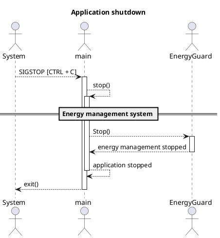

#### Energy Management System Startup

Energy management system startup is described by the following sequence diagram :

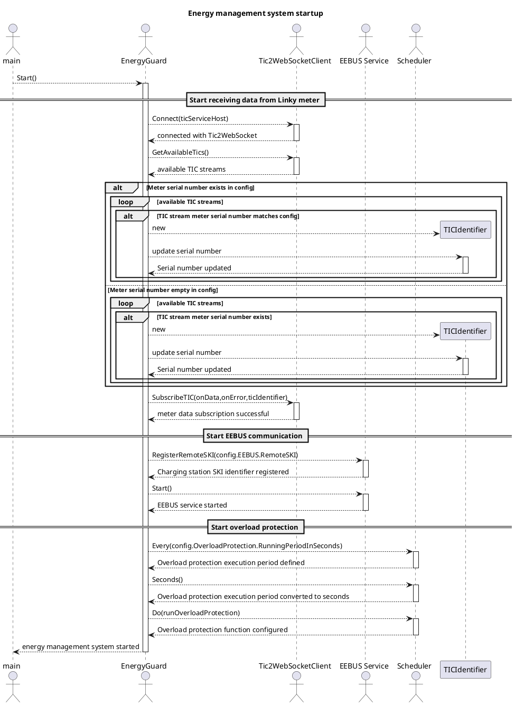

#### Energy Management System Shutdown

Energy manager shutdown is described by the following sequence diagram :

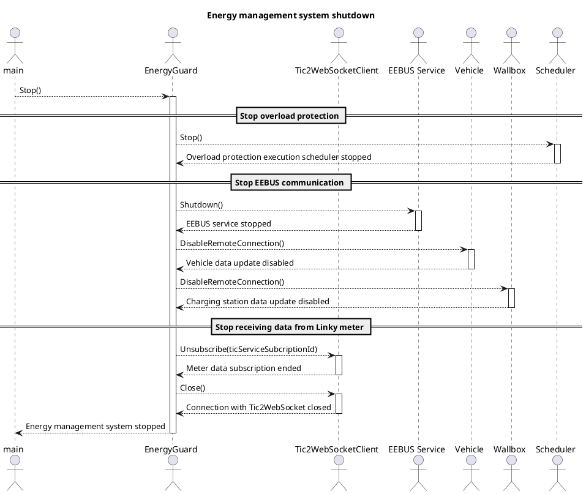

#### Energy Managerment System Periodic Regulation

Energy management system periodic regulation is explained by the flowchart below :

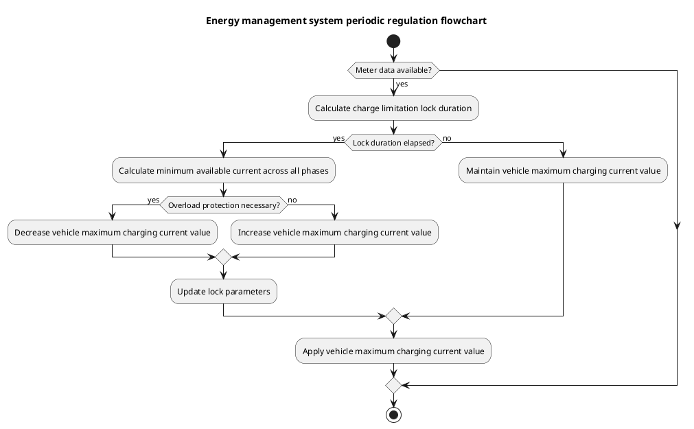

Energy management system periodic regulation is described in detail by the following sequence diagram :

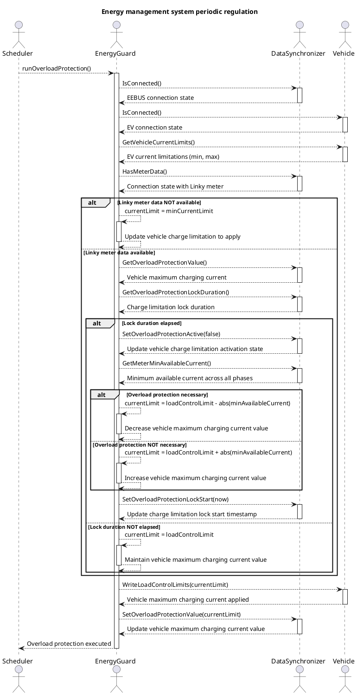

## Technical Infrastructure

### Programming Languages

The **tic4eebus** project is entirely developed in Go.

It is compatible with Go versions 1.23 and later.

### Database

The database used to access the application's data model is an [InfluxDb](https://docs.influxdata.com/influxdb/v2/) database.

Its structure consists of only one bucket (named demo-bucket) and one measurement (named EnergyGuard) belonging to the same organization "demo-org".

The data available in the table are :

- [EEBUS connection status](data_model.md#general-data) (see "IsConnected" row in the table)
- [Meter Connection status](data_model.md#general-data) (see "HasMeterData" row in the table)
- [OPEV use case indicator](data_model.md#general-data) (see "IsOpevSupported" row in the table)
- [Energy management system last error ](data_model.md#diagnostic-data-diagnosis) (see "LastErrorCode" row in the table)
- [EV charge limitation ](data_model.md#electric-vehicle-charge-limitation-data-overloadprotection) (see "Value" row in the table)
- [Meter timestamp](data_model.md#metering-device-data-model-meter) (see "DateTime" row in the table)
- [Meter breaker status](data_model.md#metering-device-data-model-meter) (see "BreakerOpened" row in the table)
- [Meter overload current limit on phase 1](data_model.md#metering-device-data-model-meter) (see "OverLoadCurrentLimit1" row in the table)
- [Meter overload current limit on phase 2](data_model.md#metering-device-data-model-meter) (see "OverLoadCurrentLimit2" row in the table)
- [Meter overload current limit on phase 3](data_model.md#metering-device-data-model-meter) (see "OverLoadCurrentLimit3" row in the table)
- [Meter RMS current on phase 1](data_model.md#metering-device-data-model-meter) (see "RmsCurrent1" row in the table)
- [Meter RMS current on phase 2](data_model.md#metering-device-data-model-meter) (see "RmsCurrent2" row in the table)
- [Meter RMS current on phase 3](data_model.md#metering-device-data-model-meter) (see "RmsCurrent3" row in the table)
- [EV RMS current on phase 1](data_model.md#electric-vehicle-ev-data-model) (see "CurrentPerPhase" row in the table)
- [EV RMS current on phase 2](data_model.md#electric-vehicle-ev-data-model) (see "CurrentPerPhase" row in the table)
- [EV RMS current on phase 3](data_model.md#electric-vehicle-ev-data-model) (see "CurrentPerPhase" row in the table)

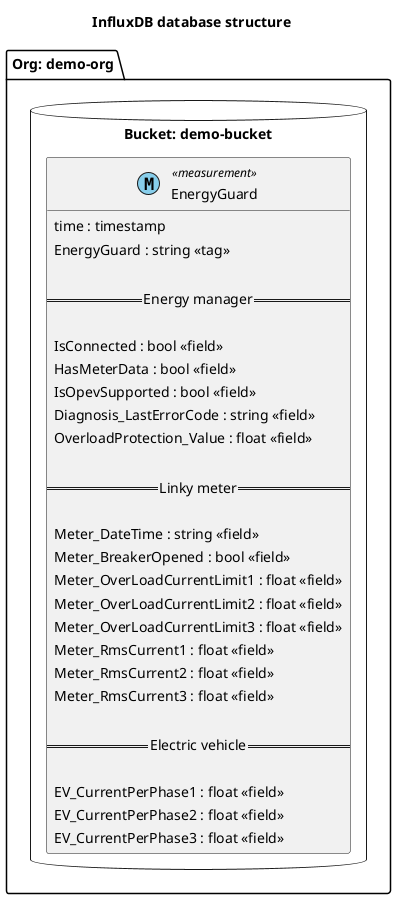

### Servers and Hosting

The **tic4eebus** application can be installed on multiple platforms (Raspberry Pi, PLC, Windows PC, Mac)

## Security

### Security Measures

All communication with the charging station is secured (see EEBUS standard)

### Access Management

The **tic4eebus** application accesses the charging station via its SKI which is in the configuration file loaded at application startup.

## Error Handling and Monitoring

### Error Handling

During periodic regulation there are 6 main possible errors:

1. Loss of connection with TIC2WebSocket which provides Linky meter data
2. Absence of TIC stream with the Linky meter in TIC2WebSocket
3. Absence of message from the Linky meter in TIC2WebSocket
4. Loss of EEBUS connection with the electric vehicle charging station
5. Non-implementation of the OPEV use case of the EEBUS standard by the charging station
6. Failure to apply the electric vehicle current limitation

All errors are logged in the application log.

Each of these errors modifies the energy management system [diagnostic](data_model.md#diagnostic-data-diagnosis) data.

When the energy manager operational state is in error (see [failure](data_model.md#devicediagnosisoperatingstateenumtype) in the table), the charging station limits the electric vehicle with the minimum charging current.

#### Loss of Connection with TIC2WebSocket

The Tic2WebSocketClient WebSocket client of the **tic4eebus** application connects to the WebSocket server of the **TIC2WebSocket** application to retrieve Linky meter business data.

If the connection with the server fails or is cut, then the **tic4eebus** application cannot receive Linky meter business data.

A periodic connection recovery attempt is made until the connection is established.

#### Absence of Meter TIC Stream in TIC2WebSocket

After the Tic2WebSocketClient WebSocket client of the **tic4eebus** application connects to the WebSocket server of the **TIC2WebSocket** application, a request is sent to retrieve the list of available TIC streams.

When no stream is available or when the specified meter is not present in the available TIC streams, retrieving Linky meter business data is not possible.

Periodic requests to list available TIC streams are executed until a meter or the specified meter is detected.

#### Absence of Message from Meter in TIC2WebSocket

After the Tic2WebSocketClient WebSocket client of the **tic4eebus** application subscribes to a meter with the WebSocket server of the **TIC2WebSocket** application, messages containing business data are retrieved periodically (with a period varying between 1 and 3 seconds).

When the Linky meter has not sent a message (TIC frame) for 10 seconds, the meter business data is obsolete and it is considered that there is no data from the meter.

When a message (TIC frame) is received again, the message absence stops and the energy manager periodic regulation resumes normally.

#### Loss of Connection with Charging Station

At **tic4eebus** application startup, the EEBUS service connects to the charging station.

When the connection with the charging station fails or is cut, then the **tic4eebus** application can no longer regulate the electric vehicle charge limitation.

A periodic connection recovery attempt with the charging station is made by the EEBUS service.

#### Non-implementation of OPEV EEBUS Use Case in Charging Station

At **tic4eebus** application startup, the EEBUS service connects to the charging station.

When the connection with the charging station is established, the EEBUS standard use cases implemented by the station can be retrieved (not on all stations).

When an electric vehicle connects, new notifications appear to provide information about the EEBUS use cases related to the electric vehicle.

The OPEV use case that interests us allows limiting electric vehicle charging.

If this use case is not implemented, then vehicle regulation is not possible.

#### Failure to Apply Electric Vehicle Charge Limitation

In the energy manager periodic regulation, the vehicle current limitation value is calculated then applied if it is different from the current limitation value.

During current limitation application, the request can be rejected and therefore the regulation non-operational.

Periodic regulation continues anyway hoping that the next current limitation application request is not rejected.

### Monitoring Tools

In the current state, there is no tool to monitor the application state and performance.

## Scalability

### Scalability Strategies

Several evolution axes are possible:

- Provide application state
- Take into account the current drawn by the vehicle in periodic regulation

## Conclusion

The tic4**tic4eebus** eebus application is a multi-platform implementation that allows implementing the OPEV use case with a Linky meter and an EEBUS-compatible charging station.
