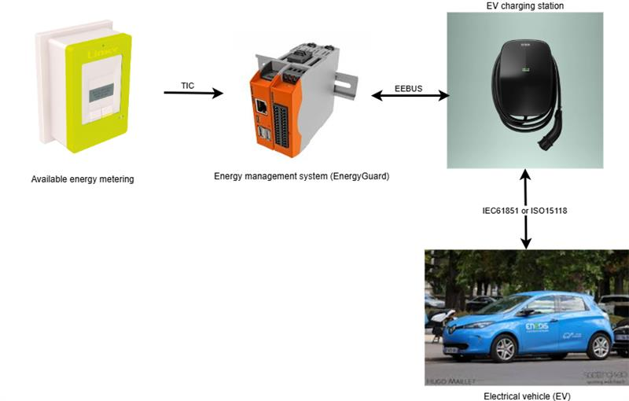

<!--
  ~ Copyright (C) 2025 Enedis Smarties team <dt-dsi-nexus-lab-smarties@enedis.fr>
  ~ 
  ~ SPDX-FileContributor: Jehan BOUSCH
  ~ 
  ~ SPDX-License-Identifier: Apache-2.0
-->

# Data Model

## Introduction

The **tic4eebus** project is organized around 4 actors:

1. The available energy metering device (Linky meter)
2. The energy manager responsible for limiting the electric vehicle (EnergyGuard in the EEBUS standard)
3. The electric vehicle charging station
4. The electric vehicle

Each of the above actors has a specific data model.

## Metering Device Data Model (Meter)

The Linky meter provides us with the following data:

|Name|Description|Mode|Format|Value|
|----|-----------|----|------|-----|
| *SerialNumber* | Linky meter serial number | Read | 12-characters string | "041976216986" |
| *DateTime* | Linky meter timestamp | Read | Date in YY/MM/DD hh:mm:ss format | "25/10/09 09:26:12" |
| *BreakerOpened* | Linky meter circuit breaker status | Read | Boolean | - **true** if the circuit breaker is open  - **false** otherwise |
| *PhaseCount* | Number of phases on the Linky meter | Read | Integer | - **1** if the meter is single-phase  - **3** if the meter is three-phase |
| *OverLoadPowerLimit* | Overload power limit of the Linky meter in VA across all phases | Read | Integer | From 0 to 99000 |
| *OverLoadCurrentLimit1* | Overload current limit of the Linky meter in A on phase 1 | Read | Decimal | From 0.0 to 99000.0 |
| *OverLoadCurrentLimit2* | Overload current limit of the Linky meter in A on phase 2 | Read | Decimal | From 0.0 to 99000.0 |
| *OverLoadCurrentLimit3* | Overload current limit of the Linky meter in A on phase 3 | Read | Decimal | From 0.0 to 99000.0 |
| *RmsVoltage1* | RMS voltage at the Linky meter in V on phase 1 | Read | Integer | From 0 to 99999 |
| *RmsVoltage2* | RMS voltage at the Linky meter in V on phase 2 | Read | Integer | From 0 to 99999 |
| *RmsVoltage3* | RMS voltage at the Linky meter in V on phase 3 | Read | Integer | From 0 to 99999 |
| *RmsCurrent1* | RMS current at the Linky meter in A imported on phase 1 | Read | Decimal | From 0.0 to 999.0 |
| *RmsCurrent2* | RMS current at the Linky meter in A imported on phase 2 | Read | Decimal | From 0.0 to 999.0 |
| *RmsCurrent3* | RMS current at the Linky meter in A imported on phase 3 | Read | Decimal | From 0.0 to 999.0 |
| *ApparentImportPower* | Apparent import power at the Linky meter in VA across all phases | Read | Integer | From 0 to 99999 |
| *ApparentImportPower1* | Apparent import power at the Linky meter in VA on phase 1 | Read | Integer | From 0 to 99999 |
| *ApparentImportPower2* | Apparent import power at the Linky meter in VA on phase 2 | Read | Integer | From 0 to 99999 |
| *ApparentImportPower3* | Apparent import power at the Linky meter terminals in VA on phase 3 | Read | Integer | From 0 to 99999 |
| *AvailableCurrent1* | Available RMS current at the Linky meter in A on phase 1 | Read | Decimal | From 0.0 to 99000.0 |
| *AvailableCurrent2* | Available RMS current at the Linky meter in A on phase 2 | Read | Decimal | From 0.0 to 99000.0 |
| *AvailableCurrent3* | Available RMS current at the Linky meter in A on phase 3 | Read | Decimal | From 0.0 to 99000.0 |

## Energy Manager Data Model

### General Data

The general data of the energy manager are as follows:

|Name|Description|Mode|Format|Value|
|----|-----------|----|------|-----|
| *IsConnected* | EEBUS connection status | Read | Boolean | - **true** if the EMS is connected with the charging station  - **false** otherwise |
| *HasMeterData* | Connection status with the Linky meter | Read | Boolean | - **true** if the Linky meter data is being read  - **false** otherwise |
| *IsOpevSupported* | Compliance indicator with the OPEV use case of the EEBUS standard | Read | Boolean | - **true** if the OPEV use case is supported  - **false** otherwise |

### Electric Vehicle Charge Limitation Data (OverloadProtection)

The charge limitation data of the energy manager are as follows:

|Name|Description|Mode|Format|Value|
|----|-----------|----|------|-----|
| *Active* | EV charge limitation activation status | Read/Write | Boolean | - **true** if a limitation is applied  - **false** otherwise |
| *Value* | EV charge limitation value in A | Read/Write | Decimal | From 0.0 to 32.0 |
| *Start* | EV charge limitation start timestamp | Read/Write | Date in UTC format | "2025-10-09T10:35:00+02:00" |
| *ResultCode* | Result code of the last EV charge limitation | Read/Write | Enumeration | Values from [ErrorNumberType](#errornumbertype) |
| *ResultDescription* | Result description of the last EV charge limitation | Read/Write | String | Detailed description of the charge limitation error |
| *LockActive* | EV charge limitation lock activation status | Read/Write | Boolean | - **true** if the lock is active  - **false** otherwise |
| *LockStart* | EV charge limitation lock start timestamp | Read/Write | Date in UTC format | "2025-10-09T10:35:00+02:00" |

### Diagnostic Data (Diagnosis)

The diagnostic data of the energy manager are as follows:

|Name|Description|Mode|Format|Value|
|----|-----------|----|------|-----|
| *OperatingState* | Operational state of the energy manager | Read/Write | Enumeration | Values from [DeviceDiagnosisOperatingStateEnumType](#devicediagnosisoperatingstateenumtype) |
| *LastErrorCode* | Last error of the energy manager | Read/Write | String | Detailed description of the manager error |

## Charging Station Data Model (EVSE)

The electric vehicle charging station provides us with the following data:

|Name|Description|Mode|Format|Value|
|----|-----------|----|------|-----|
| *IsConnected* | Connection status with the charging station | Read | Boolean | - **true** if the charging station is connected  - **false** otherwise |
| *OperatingState* | Operational state of the charging station | Read | Enumeration | Values from [DeviceDiagnosisOperatingStateEnumType](#devicediagnosisoperatingstateenumtype) |
| *ManufacturerData* | Manufacturer data identifying the charging station | Read | Structure | Values from [DeviceClassificationManufacturerDataType](#deviceclassificationmanufacturerdatatype) |

## Electric Vehicle (EV) Data Model

The electric vehicle provides us with the following data:

|Name|Description|Mode|Format|Value|
|----|-----------|----|------|-----|
| *IsConnected* | Connection status between the vehicle and the charging station | Read | Boolean | - **true** if the vehicle is connected  - **false** otherwise |
| *ChargeState* | Vehicle charging status | Read | Enumeration | - **Unknown** if the charging station's operational state is invalid  - **unplugged** if the charging station's operational state cannot be read  - **active** if the charging station is operating correctly  - **paused** if the charging station is in standby mode  - **error** if the charging station is in error  - **finished** if the charging station has completed its operations |
| *CommunicationStandard* | Communication protocol between the vehicle and the charging station | Read | Enumeration | - **iec61851** for IEC 61850 protocol  - **iso15118-2ed1** for 15118-2 protocol first edition  - **iso15118-2ed2** for 15118-2 protocol second edition |
| *AsymmetricChargingSupport* | Indicates if charging with different currents per phase is possible | Read | Boolean | - **true** if three-phase asymmetric charging is supported  - **false** otherwise |
| *Identifications* | Vehicle identifiers | Read | Array | Array of structures containing:  - **ValueType** for the type ([IdentificationTypeEnumType](#identificationtypeenumtype))  - **Value** for the identifier as string
| *ManufacturerData* | Vehicle manufacturer data | Read | Structure | Values from [DeviceClassificationManufacturerDataType](#deviceclassificationmanufacturerdatatype) |
| *ChargingPowerLimits* | Vehicle power limitations | Read | Structure | Structure containing decimal values:  - **Min** for minimum charging power  - **Max** for maximum charging power  - **Standby** for power in standby mode |
| *IsInSleepMode* | Vehicle sleep mode status | Read | Boolean | - **true** if the charging station is in sleep mode  - **false** otherwise |
| *PhasesConnected* | Number of connected vehicle phases | Read | Integer | 1, 2, or 3 phases |
| *CurrentPerPhase* | Vehicle charging current measurement on each phase | Read | Array | List of decimal values for each phase in Amperes |
| *PowerPerPhase* | Vehicle charging power measurement on each phase | Read | Array | List of decimal values for each phase in Watts |
| *EnergyCharged* | Energy charged by the vehicle measurement | Read | Decimal | Value in Watt-hours |
| *CurrentLimits* | Vehicle current limitations on each phase | Read | Structure | Structure containing decimal values in Amperes:  - **Min** for the minimum current of each phase  - **Max** for the maximum current of each phase  - **Default** for the default current of each phase |
| *LoadControlLimits* | Vehicle charging current limitations on each phase | Read/Write | Array | Array of structures containing the values:  - **Phase** to indicate the phase ([ElectricalConnectionPhaseNameEnumType](#electricalconnectionphasenameenumtype))  - **IsChangeable** to indicate if the limitation is modifiable (**true** / **false**)  - **IsActive** to indicate if the limitation is active (**true** / **false**)  - **Value** for the decimal current limitation in Amperes |

## EEBUS Data Model

### Reference Documents

The reference documents used for the data model are:

- [EEBus_SPINE_TS_ProtocolSpecification.pdf](../ref/EEBus_SPINE_TS_ProtocolSpecification.pdf)
- [EEBus_SPINE_TS_ResourceSpecification.pdf](../ref/EEBus_SPINE_TS_ResourceSpecification.pdf)

### ErrorNumberType

The ErrorNumberType enumeration (see [Table 19](../ref/EEBus_SPINE_TS_ResourceSpecification.pdf#page=71)) indicates the type of error.

It can take the following values:

|Enumeration Value|Enumeration Description|
|-----------------|-----------------------|
| 0 | No Error |
| 1 | General Error |
| 2 | Timeout |
| 3 | Overload |
| 4 | Destination unknown |
| 5 | Destination unreachable |
| 6 | Command not supported |
| 7 | Command rejected |
| 8 | Restricted function exchange combination not supported |
| 9 | Binding is necessary for this command |

### DeviceDiagnosisOperatingStateEnumType

The DeviceDiagnosisOperatingStateEnumType enumeration (see [Table 45](../ref/EEBus_SPINE_TS_ResourceSpecification.pdf#page=108)) describes the operational state of the equipment.

It can take the following values:

|Enumeration Value|Enumeration Description|
|-----------------|-----------------------|
| *normalOperation* | The device does its normal operation without any errors or limitations |
| *standby* | The device is in standby mode and does nothing but waiting for user interaction and listens on its communications protocol for external commands |
| *failure* | A failure occurred and the device cannot run as desired. Its normal functionality is likely not given |
| *serviceNeeded* | The device needs some kind of service. Possibly the normal functionality is not given |
| *overrideDetected* | The device detected an override. Normal operation may be given or the device is in some safe mode |
| *inAlarm* | An alarm (or emergency) occurred and user interaction is needed. Normal operation may be given or the device is in some safe mode |
| *notReachable* | The device has finished its temporary operation. As long as it remains in state finished, the normal operation is not given |
| *finished* | The equipment has temporarily completed its operations. As long as it remains in this state, it is not operating normally |
| *temporarilyNotReady* | The device is temporarily not ready for normal operation (e.g. due to maintenance) |
| *off* | The device is off. Hence, it cannot operate |

### DeviceClassificationManufacturerDataType

The DeviceClassificationManufacturerDataType data structure (see [§5.3.7.2](../ref/EEBus_SPINE_TS_ResourceSpecification.pdf#page=301)) identifies and describes equipment using the following fields:

|Field Name | Field Description | Field Format | Example |
|-----------|-------------------|--------------|---------|
| *DeviceName* | Equipment name | String | "EVBox-Livo-EVB-500-021-302" |
| *DeviceCode* | Equipment code | String | |
| *SerialNumber* | Serial number | String | "EVB-500-021-302" |
| *SoftwareRevision* | Software version | String | |
| *HardwareRevision* | Hardware version | String | |
| *VendorName* | Vendor name | String | |
| *VendorCode* | Vendor code | String | |
| *BrandName* | Brand name | String | "EVBox" |
| *PowerSource* | Power source | String | |
| *ManufacturerNodeIdentification* | EEBUS node manufacturer identification | String | |
| *ManufacturerLabel* | Manufacturer label | String | |
| *ManufacturerDescription* | Manufacturer description | String | |

### IdentificationTypeEnumType

The IdentificationTypeEnumType enumeration (see [Table 231](../ref/EEBus_SPINE_TS_ResourceSpecification.pdf#page=348)) describes the type of identifier.

It can take the following values:

|Enumeration Value|Enumeration Description|
|-----------------|-----------------------|
| *eui48* | MAC address in EUI-48 format |
| *eui64* | MAC address in EUI-64 format |
| *userRfidTag* | RFID tag used for identification |

### ElectricalConnectionPhaseNameEnumType

The ElectricalConnectionPhaseNameEnumType enumeration (see [Table 209](../ref/EEBus_SPINE_TS_ResourceSpecification.pdf#page=324)) indicates the measured phase(s).

It can take the following values:

|Enumeration Value|Enumeration Description|
|-----------------|-----------------------|
| a | Phase a (or L1) |
| b | Phase b (or L2) |
| c | Phase c (or L3) |
| ab | Phase a and b (or L1 and L2) |
| bc | Phase b and c (or L2 and L3) |
| ac | Phase a and c (or L1 and L3) |
| abc | Phase a, b and c (or L1, L2 and L3) |
| neutral | The neutral conductor of a connection |
| ground | The ground conductor of a connection |
| none | No phase specified or available |