<!--
  ~ Copyright (C) 2025 Enedis Smarties team <dt-dsi-nexus-lab-smarties@enedis.fr>
  ~ 
  ~ SPDX-FileContributor: Jehan BOUSCH
  ~ 
  ~ SPDX-License-Identifier: Apache-2.0
-->

# Architecture logiciel tic4eebus

## Introduction

### Objectif du Document

L'objectif de ce document est de documenter l'architecture de l'application **tic4eebus**.

### Périmètre de l'Application

L'application **tic4eebus** permet de limiter une borne de véhicule électrique (VE) en fonction de l'énergie disponible fournie par un compteur Linky.

Le logiciel implémente le cas d'utilisation OPEV de la norme EEBUS en agissant en tant que gestionnaire d'énergie (Energy Guard) pour piloter la borne VE (CEM) en fonction des données lues sur le compteur Linky (Smart Meter).

## Vue d'Ensemble de l'Architecture

### Description Générale

#### Cas d'utilisation

L'application **tic4eebus** interagit avec cinq acteurs :

- L'**_Horloge_** qui gère le déclenchement des fonctionnalités du gestionnaire d'énergie
- Le **_Système de fichier_** qui permet de conserver les données de l'application
- La **_Base de données_** qui permet d'accèder aux données de l'application
- l'**_API [TIC2WebSocket](https://github.com/Enedis-OSS/TIC2WebSocket)_** qui fournit les données métrologique du compteur Linky
- la **_[Stack EEBUS](https://github.com/enbility/eebus-go)_** qui gère l'accès à la borne de recharge et au véhicule électrique

L'acteur **_Horloge_** permet de :

- Déclencher l'ajustement de l'énergie disponible

L'acteur **_Système de fichier_** permet de :

- Conserver les données métier de l'application

L'acteur **_Base de données_** permet de :

- Accèder aux données métier de l'application (visualisation, traitement ...)

L'acteur **_API TIC2WebSocket_** permet de :

- Recevoir les données du compteur Linky

L'acteur **_Stack EEBUS_** permet :

- Limiter la charge du véhicule électrique

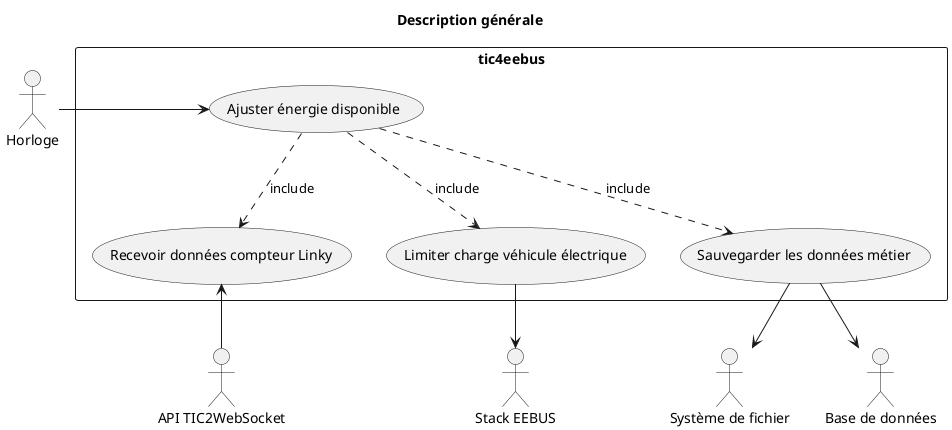

### Principaux Composants

L'application **tic4eebus** contient :

- Le composant **_main_** qui se charge du démarrage et de l'arrêt du programme
- Le composant **_config_** qui permet de charger l'ensemble des configurations de l'application
- Le composant **_ems_** qui contient le gestionnaire d'énergie de l'application
- Le composant **_ems.data_** qui gère le modèle de données de l'application
- Le composant **_linkymeter_** qui permet de recevoir les données du compteur Linky
- Le composant **_evse_** qui permet l'accès à la borne de recharge et au véhicule électrique

Elle utilise deux dépendances externes principales :

- Le composant **_[TIC2WebSocket](https://github.com/Enedis-OSS/TIC2WebSocket)_** qui permet de recevoir les trames venant de la Télé Information Client (TIC) d'un compteur
- Le composant **_[eebus-go](https://github.com/enbility/eebus-go)_** qui permet de communiquer en EEBUS avec un équipement (borne de recharge et véhicule)

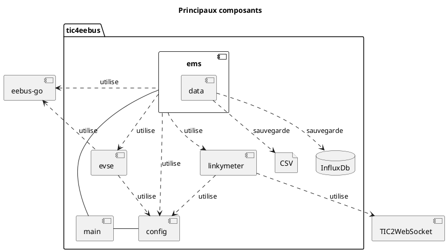

## Vue Détaillée de l'Architecture

### Composant main

#### Description

Le composant **_main_** est le composant chargé du lancement et de l'arrêt du programme.

Au lancement, il gère:

- Interprétation de la ligne de commande (fonction **_main.parseCommandLine_**)
- Chargement de la configuration (fonction **_config.LoadConfig_**)
- Initialisation des journaux de bord (fonction **_main.initLogger_**)
- Lancement du gestionnaire d'énergie (méthode **_Start_** de la classe **_ems.EnergyGuard_**)

A l'arrêt, il gère:

- L'arrêt du gestionnaire d'énergie (méthode **_Stop_** de la classe **_ems.EnergyGuard_**)

#### Dépendances

##### Dépendances internes

Le module **_main_** utilise 2 dépendances internes :

1. Le module **_config_**
2. Le module **_ems_**

##### Dépendances externes

Le module main utilise 2 dépendances externes :

1. Le paquet **_[file-rotatelogs](https://github.com/lestrrat-go/file-rotatelogs)_** pour la rotation des journaux de bord
2. Le paquet **_[logrus](https://github.com/sirupsen/logrus)_** pour la gestion des journaux de bord

#### Diagramme de Classe

Le diagramme de classe suivant décrit le composant **_main_** et ses dépendances internes :

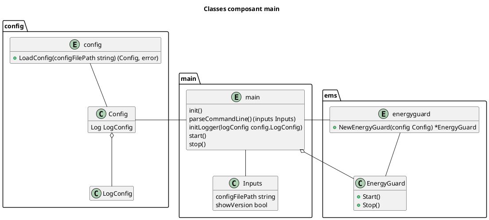

### Composant configuration

#### Description

Le composant **_config_** est le composant qui s'occupe du chargement de l'ensemble des configurations de l'application.

Il utilise :

- La configuration de l'algorithme de protection des surcharges implémentant le cas d'utilisation OPEV de la norme EEBUS (classe **_config.OverloadProtectionConfig_**)
- La configuration de l'accès aux données du véhicule électrique (classe **_config.VehicleConfig_**)
- La configuration de l'accès aux données de la borne de recharge (classe **_config.WallboxConfig_**)
- La configuration des journaux de bord de l'application (classe **_config.LogConfig_**)
- La configuration de la sauvegarde du modèle de données de l'application (classe **_config.DataModelConfig_**)
- La configuration de l'accès à la TIC du compteur Linky (classe **_config.TeleInformationClientConfig_**)
- La configuration de la communication EEBUS (classe **_config.EEBUSConfig_**)

#### Dépendances

##### Dépendances internes

Le module **_config_** n'a pas de dépendances internes.

##### Dépendances externes

Le module **_config_** utilise 2 dépendances externes :

1. Le paquet **_[logrus](https://github.com/sirupsen/logrus)_** pour utiliser le niveau de journalisation souhaité
2. Le paquet **_[yaml](https://github.com/go-yaml/yaml)_** pour décoder le fichier de configuration au format YAML

#### Diagramme de Classe

Le diagramme de classe suivant décrit le composant **_config_** et ses dépendances internes :

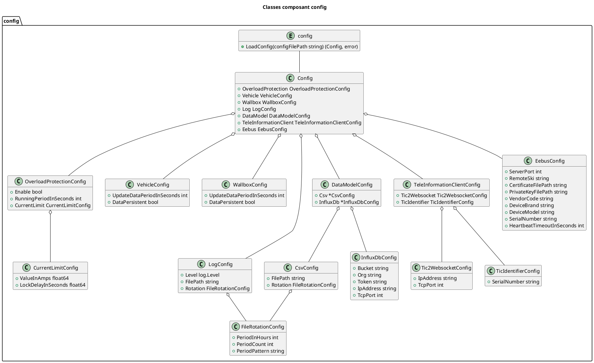

### Composant linkymeter

#### Description

Le composant linkymeter est le composant chargé de l'accès aux données du compteur Linky.

Il gère :

- L'accès à l'interface (serveur websocket) fournie par l'application TIC2WebSocket (classe **_linkymeter.TIC2WebSocketClient_**)
- La récupération des données du compteur à partir des messages envoyés par TIC2WebSocket (fonction **_linkymeter.ComputeMeterData_**)

#### Dépendances

##### Dépendances internes

Le module **_linkymeter_** n'utilise aucune dépendance interne.

##### Dépendances externes

Le module linkymeter utilise 4 dépendances externe :

1. Le paquet **_[uuid](https://github.com/google/uuid)_** pour la génération d'identifiant unique utilisé pour la souscription à un compteur auprès de l'application TIC2WebSocket
2. Le paquet **_[websocket](https://github.com/gorilla/websocket)_** pour la gestion du client websocket qui accède à l'application TIC2WebSocket
3. Le paquet **_[mapstructure](https://github.com/mitchellh/mapstructure)_** pour la conversion de dictionnaire en structure de données
4. Le paquet **_[logrus](https://github.com/sirupsen/logrus)_** pour le journal de bord de l'application

#### Diagramme de Classe

Le diagramme de classe suivant décrit le composant **_linkymeter_** et ses dépendances internes :

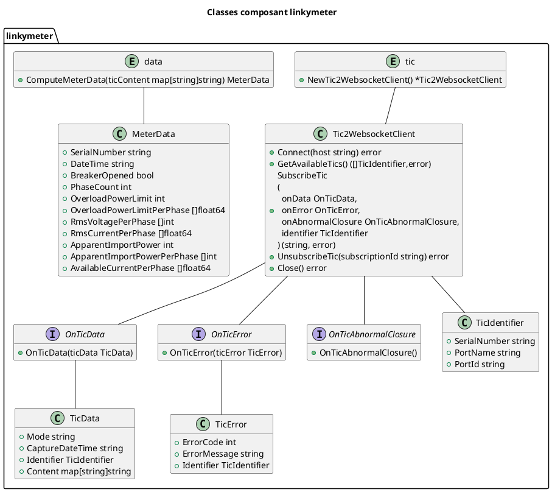

### Composant evse

#### Description

Le composant **_evse_** est le composant chargé de la lecture des données de la borne de recharge et du véhicule électrique.

Il utilise :

- La configuration de la borne de recharge (classe **_config.WallboxConfig_**)
- La configuration du véhicule électrique (classe **_config.VehiculeConfig_**)
- Le composant borne de recharge qui gère les message EEBUS liés à la borne (classe **_evse.Wallbox_**)
- Le composant véhicule électrique qui gère les message EEBUS liés au véhicule (classe **_evse.Vehicle_**)

#### Dépendances

##### Dépendances internes

Le module **_evse_** utilise 1 dépendance interne :

- Le module config

##### Dépendances externes

Le module evse utilise 5 dépendances externes :

1. Le paquet **_[eebus-go](https://github.com/enbility/eebus-go)_** pour le service EEBUS et les cas d'utilisation EEBUS (EVSECC, EVCC, EVCEM, OPEV) EEBUS
2. Le paquet **_[spine-go](https://github.com/enbility/spine-go)_** pour l'accès aux équipements et entité EEBUS permettant la récupération d'information (état fonctionnel de la borne, standard de communication du VE, résultat de la limitation du VE)
3. Le paquet **_[gocron](https://github.com/go-co-op/gocron)_** pour le lancement d'un tâche périodique de lecture des informations du VE et de la borne de recharge
4. Le paquet **_[uuid](https://github.com/google/uuid)_** pour l'identifiant unique de souscription aux informations du VE et de la borne de recharge
5. Le paquet **_[logrus](https://github.com/sirupsen/logrus)_** pour le journal de bord de l'application concernant le VE et la borne de recharge

#### Diagramme de Classe

Le diagramme de classe suivant décrit le composant synchroniser et ses dépendances internes :

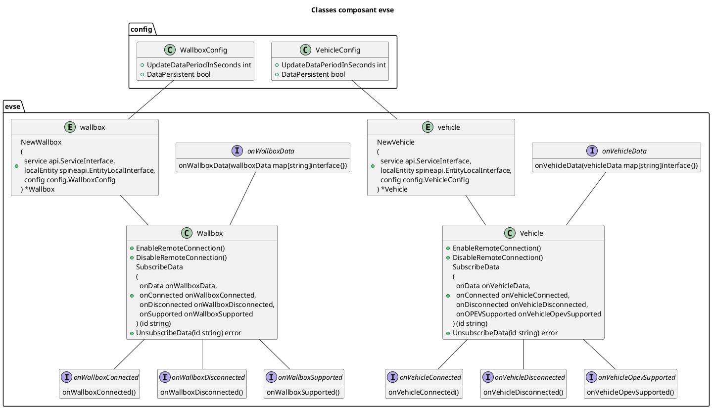

### Composant ems

#### Description

Le composant **_ems_** est le composant qui implémente le gestionnaire d'énergie appelé Energy Guard dans la norme EEBUS.

Il utilise :

- La configuration globale de l'application (classe **_config.Config_**)
- Le client TIC2WebSocket pour recevoir les données du compteur Linky (classe **_linkymeter.Tic2WebSocketClient_**)
- La conversion des données brutes du compteur Linky en données métier (fonction **_linkymeter.ComputeMeterData_**)
- La sauvegarde des données de l'application (classe **_ems.data.DataSynchronizer_**))
- La récupération les données du véhicule électrique (classe **_evse.Vehicle_**)
- La récupération les données de la borne de recharge (classe **_evse.Wallbox_**)

#### Dépendances

##### Dépendances internes

Le composant **_ems_** utilise 4 dépendances interne :

1. Le paquet **_config_**
2. Le paquet **_linkymeter_**
3. Le paquet **_evse_**
4. Le paquet **_ems.data_**

##### Dépendances externes

Le composant ems utilise 7 dépendances externes :

1. Le paquet **_[eebus-go](https://github.com/enbility/eebus-go)_** pour la gestion du service EEBUS et le le diagnostique du gestionnaire d'énergie
2. Le paquet **_[ship-go](https://github.com/enbility/ship-go)_** pour la définition du service EEBUS distant et l'état de la connexion distante
3. Le paquet **_[spine-go](https://github.com/enbility/spine-go)_** pour l'interface de l'entité EEBUS locale et les informations de résultat de l'écriture de la consigne de limitation de courant du VE
4. Le paquet **_[gocron](https://github.com/go-co-op/gocron)_** pour le lancement de la tâche de régulation périodique de la limitation de la charge du VE
5. Le paquet **_[cmp](https://github.com/google/go-cmp)_** pour détecter les modifications des informations du VE et de la borne de recharge
6. Le paquet **_[uuid](https://github.com/google/uuid)_** pour l'identifiant unique de souscription aux informations du gestionnaire d'énergie
7. Le paquet **_[logrus](https://github.com/sirupsen/logrus)_** pour le journal de bord de l'application concernant le gestionnaire d'énergie

#### Diagramme de Classe

Le diagramme de classe suivant décrit le composant ems et ses dépendances internes :

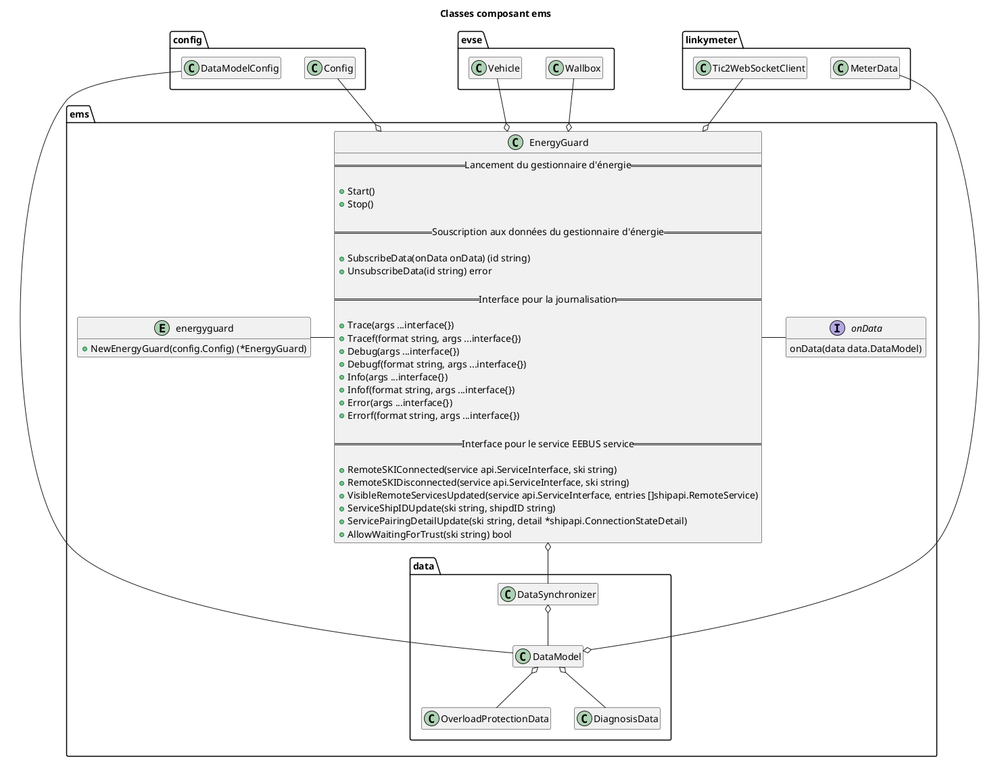

### Composant ems.data

#### Description

Le composant **_ems.data_** est le composant qui sauvegarde le [modèle de données](data_model.md) de l'application.

Il utilise :

- La configuration du modèle de données de l'application (classe **_config.DataModelConfig_**)
- Le modèle de données de l'application (classe **_ems.data.DataModel_**)
- L'interface de gestion du modèle de données (classe **_ems.data.DataSynchronizer_**)
- L'interface de sauvegarde du modèle de données dans un fichier CSV (classe **_ems.data.CsvWriter_**)
- L'interface de sauvegarde du modèle de données dans une base de données InfluxDb (classe **_ems.data.InfluxDbWriter_**)

#### Dépendances

##### Dépendances internes

Le composant **_ems_** utilise 3 dépendances interne :

1. Le paquet **_config_**
2. Le paquet **_linkymeter_**
3. Le paquet **_evse_**

##### Dépendances externes

Le composant ems utilise 6 dépendances externes :

1. Le paquet **_[eebus-go](https://github.com/enbility/eebus-go)_** pour les types de données liées au véhicule électrique et à la borne de recharge
2. Le paquet **_[spine-go](https://github.com/enbility/spine-go)_** pour les types de données liées au diagnostique, à la limitation de la charge du VE et à l'état fonctionnel de la borne de recharge
3. Le paquet **_[influxdb-client-go](https://github.com/influxdata/influxdb-client-go)_** pour l'accès à la base de données InfluxDb
4. Le paquet **_[cmp](https://github.com/google/go-cmp)_** pour comparer les nouvelles données de VE et de la borne aux données actuelle
5. Le paquet **_[file-rotatelogs](https://github.com/lestrrat-go/file-rotatelogs)_** pour la rotation des fichiers CSV
6. Le paquet **_[logrus](https://github.com/sirupsen/logrus)_** pour le journal de bord de l'application concernant le modèle de données

#### Diagramme de Classe

Le diagramme de classe suivant décrit le composant ems.data et ses dépendances internes :

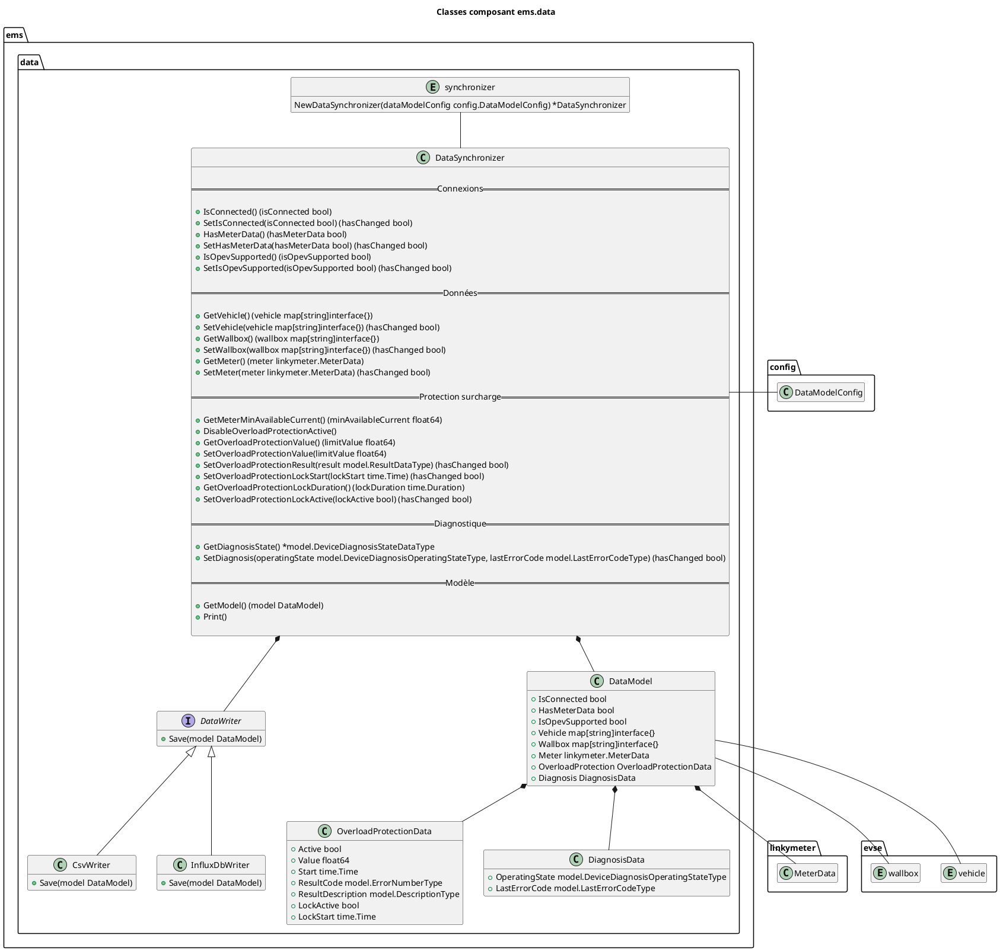

## Modèles d'Interaction

### Diagrammes de Séquence

Les diagrammes de séquence permettent d'illustrer les interactions entre les composants concernant :

- Le lancement de l'application
- L'arrêt de l'application
- Le démarrage du gestionnaire d'énergie
- L'arrêt du gestionnaire d'énergie
- La régulation périodique du gestionnaire d'énergie

#### Lancement de l'application

Le lancement de l'application est décrit par le diagramme de séquence suivant :

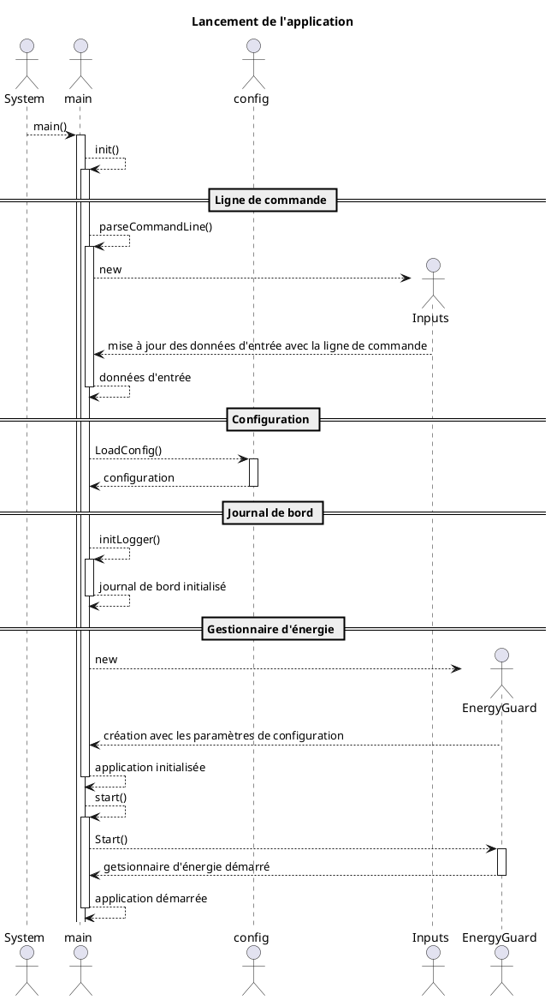

#### Arrêt de l'application

L'arrêt de l'application est décrit par le diagramme de séquence suivant :

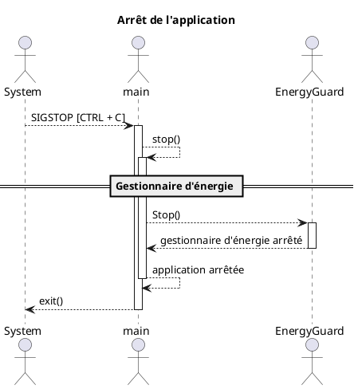

#### Lancement du gestionnaire d'énergie

Le lancement du gestionnaire d'énergie est décrit par le diagramme de séquence suivant :

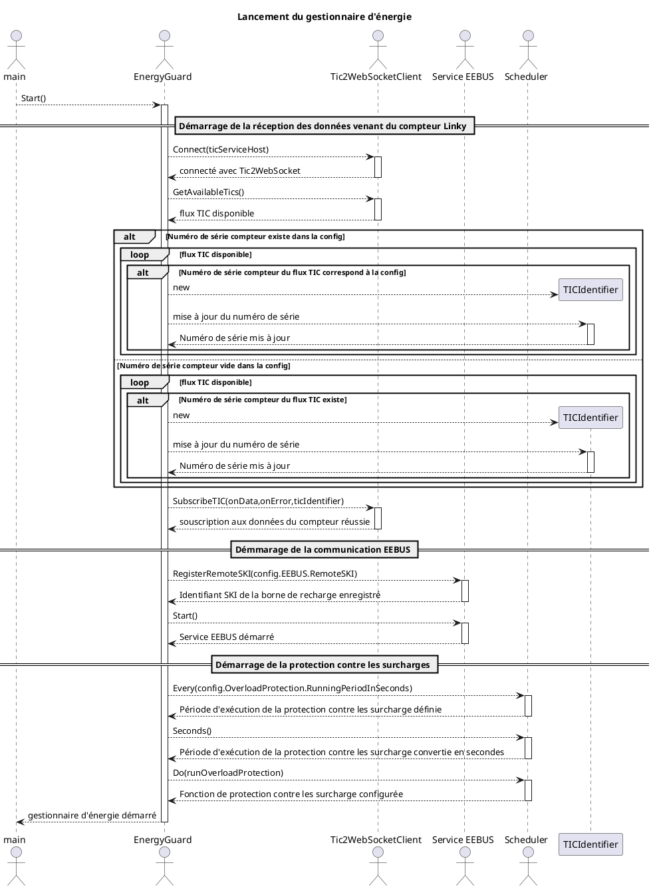

#### Arrêt du gestionnaire d'énergie

L'arrêt du gestionnaire d'énergie est décrit par le diagramme de séquence suivant :

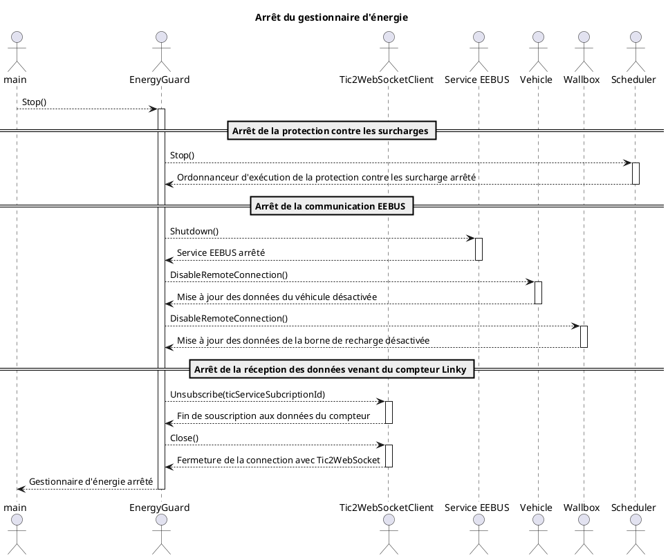

#### Régulation périodique du gestionnaire d'énergie

La régulation périodique du gestionnaire d'énergie est expliquée par le logigramme ci-dessous :

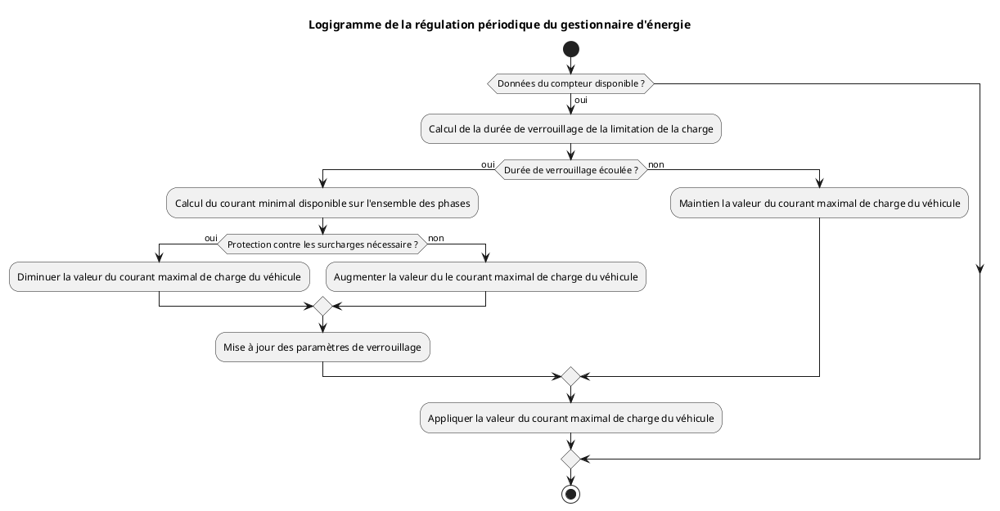

La régulation périodique du gestionnaire d'énergie est décrit en détail par le diagramme de séquence suivant :

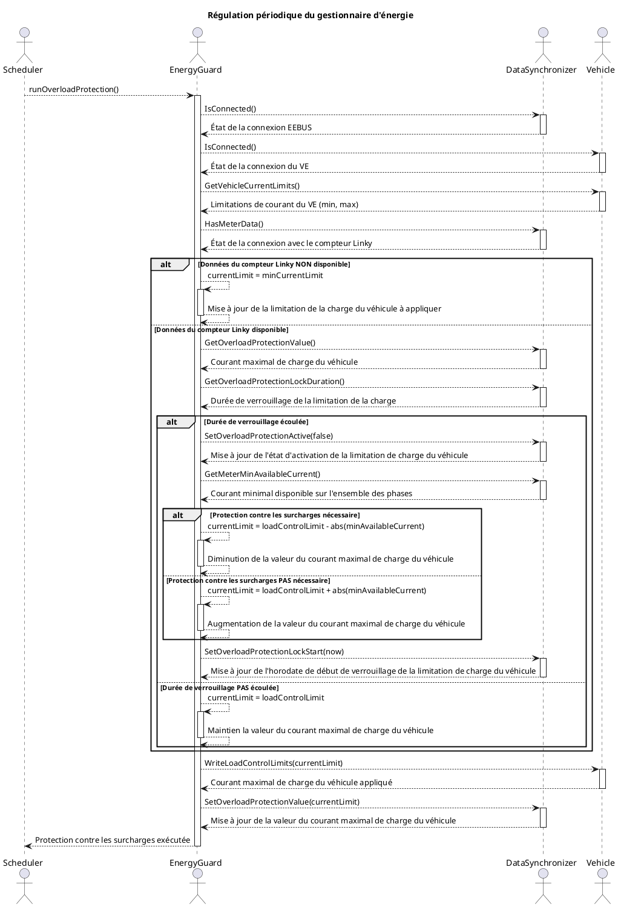

## Infrastructure Technique

### Langages de Programmation

Le projet **tic4eebus** est intégralement développé en go.

Il est compatible avec les versions go 1.23 et ultérieures.

### Base de Données

La base de données utilisée pour accèder au modèle de données de l'application est une base [InfluxDb](https://docs.influxdata.com/influxdb/v2/).

Sa structure ne comporte qu'une seule base (bucket nommé demo-bucket) et une seule table (measurement nommé EnergyGuard) appartenant à la même organisation "demo-org".

Les données disponibles dans la table sont les suivantes :

- [État de la connexion EEBUS](data_model.md#donnees-generales) (voir la ligne "IsConnected" du tableau)
- [État de la connexion avec le compteur](data_model.md#donnees-generales) (voir la ligne "HasMeterData" du tableau)
- [Indicateur du cas d'utilisation OPEV](data_model.md#donnees-generales) (voir la ligne "IsOpevSupported" du tableau)
- [Dernière erreur du gestionnaire d'énergie](data_model.md#donnees-de-diagnostique-diagnosis) (voir la ligne "LastErrorCode" du tableau)
- [Limitation de charge du VE](data_model.md#donnees-de-limitation-de-la-charge-du-vehicule-electrique-overloadprotection) (voir la ligne "Value" du tableau)
- [Horodate du compteur](data_model.md#modele-de-donnees-du-dispositif-de-comptage-meter) (voir la ligne "DateTime" du tableau)
- [État de l'organe de coupure du compteur](data_model.md#modele-de-donnees-du-dispositif-de-comptage-meter) (voir la ligne "BreakerOpened" du tableau)
- [Courant de coupure sur la phase 1 du compteur](data_model.md#modele-de-donnees-du-dispositif-de-comptage-meter) (voir la ligne "OverLoadCurrentLimit1" du tableau)
- [Courant de coupure sur la phase 2 du compteur](data_model.md#modele-de-donnees-du-dispositif-de-comptage-meter) (voir la ligne "OverLoadCurrentLimit2" du tableau)
- [Courant de coupure sur la phase 3 du compteur](data_model.md#modele-de-donnees-du-dispositif-de-comptage-meter) (voir la ligne "OverLoadCurrentLimit3" du tableau)
- [Courant efficace sur la phase 1 du compteur](data_model.md#modele-de-donnees-du-dispositif-de-comptage-meter) (voir la ligne "RmsCurrent1" du tableau)
- [Courant efficace sur la phase 2 du compteur](data_model.md#modele-de-donnees-du-dispositif-de-comptage-meter) (voir la ligne "RmsCurrent2" du tableau)
- [Courant efficace sur la phase 3 du compteur](data_model.md#modele-de-donnees-du-dispositif-de-comptage-meter) (voir la ligne "RmsCurrent3" du tableau)
- [Courant efficace sur la phase 1 du VE](data_model.md#modele-de-donnees-du-vehicule-electrique-ve) (voir la ligne "CurrentPerPhase" du tableau)
- [Courant efficace sur la phase 2 du VE](data_model.md#modele-de-donnees-du-vehicule-electrique-ve) (voir la ligne "CurrentPerPhase" du tableau)
- [Courant efficace sur la phase 3 du VE](data_model.md#modele-de-donnees-du-vehicule-electrique-ve) (voir la ligne "CurrentPerPhase" du tableau)

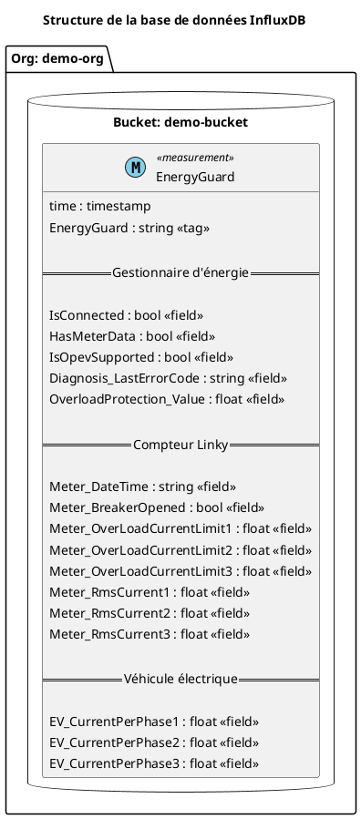

### Serveurs et Hébergement

L'application  **tic4eebus** est installable sur de multiples plateformes (Raspberry Pi, PAC, PC Windows, Mac)

## Sécurité

### Mesures de Sécurité

L'ensemble de la communication avec la borne de recharge est sécurisée (voir norme EEBUS)

### Gestion des Accès

L'application  **tic4eebus**  accède à la borne de recharge via son SKI qui est dans le fichier de configuration chargé au démarrage de l'application.

## Gestion des Erreurs et Surveillance

### Gestion des Erreurs

Au moment de la régulation périodique il y a 6 erreurs principales possibles:

1. La perte de connexion avec TIC2WebSocket qui fourni les données du compteur Linky
2. L'absence de flux TIC avec le compteur Linky dans le TIC2WebSocket
3. L'absence de message venant du compteur Linky dans le TIC2WebSocket
4. La perte de connexion EEBUS avec la borne de recharge de véhicule électrique
5. La non implémentation du cas d'utilisation OPEV de la norme EEBUS par la borne de recharge
6. L'échec d'application de la limitation du courant du véhicule électrique

Tous les erreurs sont tracés dans le journal de bord de l'application.

Chacune de ces erreurs modifie les données de [diagnostique](data_model.md#donnees-de-diagnostique-diagnosis) du gestionnaire d'énergie.

Lorsque l'état fonctionnel du gestionnaire d'énergie est en erreur (voir [failure](data_model.md#devicediagnosisoperatingstateenumtype) dans le tableau) la borne de recharge limite le véhicule électrique avec le courant minimal de recharge.

#### Perte de connexion avec TIC2WebSocket

Le client WebSocket Tic2WebSocketClient de l'application **tic4eebus** se connecte au serveur WebSocket de l'application **TIC2WebSocket** pour récupérer les données métier du compteur Linky.

Si la connexion avec le serveur échoue ou si elle se coupe alors l'application **tic4eebus** ne peux pas recevoir les données métier du compteur Linky.

Une tentative de reprise de connexion périodique est réalisée jusqu'à l'établissement de la connexion.

#### Absence de flux TIC du compteur dans TIC2WebSocket

Après connexion du client WebSocket Tic2WebSocketClient de l'application **tic4eebus** avec le serveur WebSocket de l'application **TIC2WebSocket** une requête est envoyé pour récupérer la liste des flux TIC disponible.

Lorsqu'aucun flux n'est disponible ou lorsque le compteur spécifié n'est pas présent dans les flux TIC disponible la récupération des données métier du compteur Linky n'est pas possible.

Des requêtes périodiques pour lister les flux TIC disponible sont exécutées jusqu'à la détection d'un compteur ou du compteur spécifié.

#### Absence de message venant du compteur dans TIC2WebSocket

Après souscription du client WebSocket Tic2WebSocketClient de l'application **tic4eebus** auprès du serveur WebSocket de l'application **TIC2WebSocket** à un compteur les messages contenant les données métier sont récupérés périodiquement (avec une période variant entre 1 et 3 secondes).

Lorsque le compteur Linky n'a pas envoyé de message (trame TIC) pendant 10 secondes les données métier du compteur sont caduques et on considère qu'il y a absence de données du compteur.

Lorsqu'un message (trame TIC) est reçu de nouveau l'absence de message s'arrête et la régulation périodique du gestionnaire d'énergie reprend normalement.

#### Perte de connexion avec la borne de recharge

Au démarrage de l'application **tic4eebus** le service EEBUS se connecte à la borne de recharge.

Lorsque la connexion avec la borne de recharge échoue ou se coupe alors l'application **tic4eebus** ne peut plus réguler la limitation de la charge du véhicule électrique.

Une tentative de reprise de connexion périodique avec la borne de recharge est réalisée par le service EEBUS.

#### Non implémentation de cas d'utilisation OPEV EEBUS dans la borne de recharge

Au démarrage de l'application **tic4eebus** le service EEBUS se connecte à la borne de recharge.

Lorsque la connexion avec la borne de recharge est établie les cas d'utilisation de la norme EEBUS implémenté par la borne peuvent être récupérés (pas sur toutes les bornes).

Lorsqu'un véhicule électrique se connecte de nouvelles notifications apparaissent pour renseigner sur les cas d'utilisation EEBUS lié au véhicule électrique.

Le cas d'utilisation OPEV qui nous intéresse permet de limiter la charge du véhicule électrique.

Si ce cas d'utilisation n'est pas implémenté alors la régulation du véhicule n'est pas possible.

#### Echec d'application de la limitation de charge du véhicule électrique

Dans la régulation périodique du gestionnaire d'énergie, la valeur de la limitation de courant du véhicule est calculée puis appliquée si elle est différent de la valeur limitation actuelle.

Pendant l'application de la limitation de courant la requête peut être rejetée et donc la régulation non opérationnelle.

La régulation périodique continue malgré tout en espérant que la prochaine requête d'application de la limitation de courant ne soit pas rejetée.

### Outils de Surveillance

En l'état actuel, il n'y a pas d'outil pour surveiller l'état et les performances de l'application.

## Évolutivité

### Stratégies d'Évolutivité

Plusieurs axes d'évolution sont possibles :

- Fournir l'état de l'application
- Prendre en compte le courant soutiré par le véhicule dans la régulation périodique

## Conclusion

L'application **tic4eebus** est une implémentation multi-plateforme qui permet d'implémenter le cas d'utilisation OPEV avec un compteur Linky et une borne de recharge compatible EEBUS.