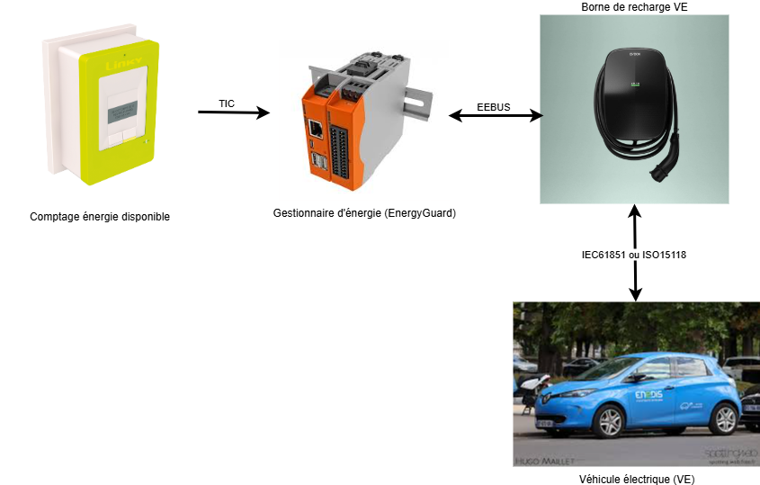

<!--
  ~ Copyright (C) 2025 Enedis Smarties team <dt-dsi-nexus-lab-smarties@enedis.fr>
  ~ 
  ~ SPDX-FileContributor: Jehan BOUSCH
  ~ 
  ~ SPDX-License-Identifier: Apache-2.0
-->

# Modèle de données

## Introduction

Le projet **tic4eebus** est organisé autour de 4 acteurs :

1. Le dispositif de comptage d’énergie disponible (compteur Linky)
2. Le gestionnaire d’énergie chargé de limiter le Véhicule électrique (EnergyGuard dans la norme EEBUS)
3. La borne de recharge de véhicule électrique
4. Le véhicule électrique

Chacun des acteurs ci-dessus possède un modèle de données spécifique.

## Modèle de données du dispositif de comptage (Meter)

La compteur Linky nous fournit les données suivantes :

|Nom|Description|Mode|Format|Valeur|
|---|-----------|----|------|------|
| *SerialNumber* | Numéro de série du compteur Linky | Lecture | Chaine de 12 caractères | "041976216986" |
| *DateTime* | Horodate du compteur Linky | Lecture | Date au format AA/MM/JJ hh:mm:ss | "25/10/09 09:26:12" |
| *BreakerOpened* | État de l'organe de coupure du compteur Linky | Lecture | Booléen | - **true** si l'organe de coupure est ouvert  - **false** sinon |
| *PhaseCount* | Nombre de phase du compteur Linky | Lecture | Entier | - **1** si le compteur est monophasé  - **3** sisi le compteur est triphasé |
| *OverLoadPowerLimit* | Puissance apparente de coupure du compteur Linky en VA sur l'ensemble des phases | Lecture | Entier | De 0 à 99000 |
| *OverLoadCurrentLimit1* | Courant de coupure du compteur Linky en A sur la phase 1 | Lecture | Décimal | De 0.0 à 99000.0 |
| *OverLoadCurrentLimit2* | Courant de coupure du compteur Linky en A sur la phase 2 | Lecture | Décimal | De 0.0 à 99000.0 |
| *OverLoadCurrentLimit3* | Courant de coupure du compteur Linky en A sur la phase 3 | Lecture | Décimal | De 0.0 à 99000.0 |
| *RmsVoltage1* | Tension efficace aux bornes du compteur Linky en V sur la phase 1 | Lecture | Entier | De 0 à 99999 |
| *RmsVoltage2* | Tension efficace aux bornes du compteur Linky en V sur la phase 2 | Lecture | Entier | De 0 à 99999 |
| *RmsVoltage3* | Tension efficace aux bornes du compteur Linky en V sur la phase 3 | Lecture | Entier | De 0 à 99999 |
| *RmsCurrent1* | Courant efficace soutiré aux bornes du compteur Linky en A sur la phase 1 | Lecture | Décimal | De 0.0 à 999.0 |
| *RmsCurrent2* | Courant efficace soutiré aux bornes du compteur Linky en A sur la phase 2 | Lecture | Décimal | De 0.0 à 999.0 |
| *RmsCurrent3* | Courant efficace soutiré aux bornes du compteur Linky en A sur la phase 3 | Lecture | Décimal | De 0.0 à 999.0 |
| *ApparentImportPower* | Puissance apparente instantanée soutirée aux bornes du compteur Linky en VA sur l'ensemble des phases | Lecture | Entier | De 0 à 99999 |
| *ApparentImportPower1* | Puissance apparente instantanée soutirée aux bornes du compteur Linky en VA sur la phase 1 | Lecture | Entier | De 0 à 99999 |
| *ApparentImportPower2* | Puissance apparente instantanée soutirée aux bornes du compteur Linky en VA sur la phase 2 | Lecture | Entier | De 0 à 99999 |
| *ApparentImportPower3* | Puissance apparente instantanée soutirée aux bornes du compteur Linky en VA sur la phase 3 | Lecture | Entier | De 0 à 99999 |
| *AvailableCurrent1* | Courant efficace soutiré disponible aux bornes du compteur Linky en A sur la phase 1 | Lecture | Décimal | De 0.0 à 99000.0 |
| *AvailableCurrent2* | Courant efficace soutiré disponible aux bornes du compteur Linky en A sur la phase 2 | Lecture | Décimal | De 0.0 à 99000.0 |
| *AvailableCurrent3* | Courant efficace soutiré disponible aux bornes du compteur Linky en A sur la phase 3 | Lecture | Décimal | De 0.0 à 99000.0 |

## Modèle de données du gestionnaire d'énergie

### Données générales

Les données générales du gestionnaire d'énergie sont les suivantes :

|Nom|Description|Mode|Format|Valeur|
|---|-----------|----|------|------|
| *IsConnected* | État de la connexion EEBUS | Lecture | Booléen | - **true** si le gestionnaire est connecté avec la borne  - **false** sinon |
| *HasMeterData* | État de la connexion avec le compteur Linky | Lecture | Booléen | - **true** si les données du compteur Linky sont lues  - **false** sinon |
| *IsOpevSupported* | Indicateur de conformité avec le cas d'utilisation OPEV de la norme Lecture EEBUS | Lecture | Booléen | - **true** si le cas d'utilisation OPEV est supporté  - **false** sinon |

### Données de limitation de la charge du véhicule électrique (OverloadProtection)

Les données de limitation de la charge du gestionnaire d'énergie sont les suivantes :

|Nom|Description|Mode|Format|Valeur|
|---|-----------|----|------|------|
| *Active* | État d'activation de la limitation de charge du VE | Lecture/Écriture | Booléen | - **true** si une limitation est appliqué  - **false** sinon |
| *Value* | Valeur de la limitation de charge du VE en A | Lecture/Écriture | Décimal | De 0.0 à 32.0 |
| *Start* | Horodate de début de limitation de charge du VE | Lecture/Écriture | Date au format UTC | "2025-10-09T10:35:00+02:00" |
| *ResultCode* | Code de résultat de la dernière limitation de charge de VE | Lecture/Écriture | Énumération | Valeurs de [ErrorNumberType](#errornumbertype) |
| *ResultDescription* | Description du résultat de la dernière limitation de charge de VE | Lecture/Écriture | Chaine de caractères | Description détaillée de l'erreur de limitation de charge |
| *LockActive* | État d'activation du maintien de la limitation de charge de VE | Lecture/Écriture | Booléen | - **true** si le maintien est actif  - **false** sinon |
| *LockStart* | Horodate de début de maintien de la limitation de charge du VE | Lecture/Écriture | Date au format UTC | "2025-10-09T10:35:00+02:00" |

### Données de diagnostique (Diagnosis)

Les données de diagnostique du gestionnaire d'énergie sont les suivantes :

|Nom|Description|Mode|Format|Valeur|
|---|-----------|----|------|------|
| *OperatingState* | État fonctionnel du gestionnaire d'énergie | Lecture/Écriture | Énumération | Valeurs de [DeviceDiagnosisOperatingStateEnumType](#devicediagnosisoperatingstateenumtype) |
| *LastErrorCode* | Dernière erreur du gestionnaire d'énergie | Lecture/Écriture | Chaine de caractères | Description détaillée de l'erreur du gestionnaire |

## Modèle de données de la borne de recharge (EVSE)

La borne de recharge de véhicule électrique nous fournit les données suivantes :

|Nom|Description|Mode|Format|Valeur|
|---|-----------|----|------|------|
| *IsConnected* | État de la connexion avec la borne | Lecture | Booléen | - **true** si la borne est connectée  - **false** sinon |
| *OperatingState* | État fonctionnel de la borne | Lecture | Énumération | Valeurs de [DeviceDiagnosisOperatingStateEnumType](#devicediagnosisoperatingstateenumtype) |
| *ManufacturerData* | Données constructeur identifiant la borne | Lecture | Structure | Valeurs de [DeviceClassificationManufacturerDataType](#deviceclassificationmanufacturerdatatype) |

## Modèle de données du Véhicule Électrique (VE)

Le véhicule électrique nous fournit les données suivantes :

|Nom|Description|Mode|Format|Valeur|
|---|-----------|----|------|------|
| *IsConnected* | État de la connexion entre le véhicule et la borne | Lecture | Booléen | - **true** si le véhicule est connectée  - **false** sinon |
| *ChargeState* | État de la charge du véhicule | Lecture | Énumération | - **Unknown** si l'état fonctionnel de la borne est invalide  - **unplugged** si l'état fonctionnel de la borne ne peut être lu  - **active** si la borne fonctionne correctement  - **paused** si la borne est en mode veille  - **error** si la borne est en erreur  - **finished** si la borne a terminé ses opérations |
| *CommunicationStandard* | Protocole de communication entre le véhicule et la borne de recharge | Lecture | Énumération | - **iec61851** pour le protocole IEC 61850  - **iso15118-2ed1** pour le protocole 15118-2 première édition  - **so15118-2ed2** pour le protocole 15118-2 seconde édition |
| *AsymmetricChargingSupport* | Indique si la recharge avec des courants différents par phase est possible | Lecture | Booléen | - **true** si la charge asymétrique triphasée est supportée  - **false** sinon |
| *Identifications* | Identifiants du véhicule | Lecture | Tableau | Tableau de structure contenant :  - **ValueType** pour le type ([IdentificationTypeEnumType)](#identificationtypeenumtype))  - **Value** pour l’identifiant en chaine de caractères |
| *ManufacturerData* | Données constructeur du véhicule | Lecture | Structure | Valeurs de [DeviceClassificationManufacturerDataType](#deviceclassificationmanufacturerdatatype) |
| *ChargingPowerLimits* | Limitations de puissance du véhicule | Lecture | Structure | Structure contenant les valeurs décimales :  - **Min** pour la puissance minimale de charge  - **Max** pour la puissance maximale de charge  - **Standby** pour la puissance en mode veille |
| *IsInSleepMode* | État du mode veille du véhicule | Lecture | Booléen | - **true** si la borne est en mode veille  - **false** sinon |
| *PhasesConnected* | Nombre de phases du véhicule connectées | Lecture | Entier | 1, 2 ou 3 phases |
| *CurrentPerPhase* | Mesure du courant de charge du véhicule sur chaque phase | Lecture | Tableau | Liste de valeurs décimales pour chaque phase en Ampère |
| *PowerPerPhase* | Mesure de puissance de charge du véhicule sur chaque phase | Lecture | Tableau | Liste de valeurs décimales pour chaque phase en Watt |
| *EnergyCharged* | Mesure de l’énergie chargée par le véhicule | Lecture | Décimal | Valeur en Wattheure |
| *CurrentLimits* | Limitations de courant du véhicule sur chaque phase | Lecture | Structure | Structure contenant les valeurs décimales en Ampère :  - **Min** pour le courant minimal de chaque phase  - **Max** pour le courant maximal de chaque phase  - **Default** pour le courant par défaut de chaque phase |
| *LoadControlLimits* | Limitations du courant de charge du véhicule sur chaque phase | Lecture/Écriture | Tableau | Tableau de structure contenant les valeurs :  - **Phase** pour indiquer la phase ([ElectricalConnectionPhaseNameEnumType](#electricalconnectionphasenameenumtype))  - **IsChangeable** pour indiquer si la limitation est modifiable (**true** / **false**)  - **IsActive** pour indiquer si la limitation est active (**true** / **false**)  - **Value** pour la limitation de courant décimale en Ampère |

## Modèle de données EEBUS

### Documents de référence

Les documents de référence utilisés pour le modèle de données sont :

- [EEBus_SPINE_TS_ProtocolSpecification.pdf](../var/references/EEBus_SPINE_TS_ProtocolSpecification.pdf)
- [EEBus_SPINE_TS_ResourceSpecification.pdf](../var/references/EEBus_SPINE_TS_ResourceSpecification.pdf)

### ErrorNumberType

L'énumération ErrorNumberType (voir [Table 19](../var/references/EEBus_SPINE_TS_ResourceSpecification.pdf#page=71)) indique le type d'erreur.

Elle peut prendre les valeurs suivantes :

|Valeur de l'énumération|Description de l'énumération|
|-----------------------|----------------------------|
| 0 | Aucune erreur |
| 1 | Erreur générale |
| 2 | Délai imparti dépassé |
| 3 | Surcharge |
| 4 | Destination inconnue |
| 5 | Destination injoignable |
| 6 | Commande non supportée |
| 7 | Commande rejetée |
| 8 | Combinaison d'échange de fonctions restreintes non supportée |
| 9 | Liaison nécessaire pour cette commande |

### DeviceDiagnosisOperatingStateEnumType

L'énumération DeviceDiagnosisOperatingStateEnumType (voir [Table 45](../var/references/EEBus_SPINE_TS_ResourceSpecification.pdf#page=108)) décrit l'état fonctionnel de l'équipement.

Elle peut prendre les valeurs suivantes :

|Valeur de l'énumération|Description de l'énumération|
|-----------------------|----------------------------|
| *normalOperation* | L'équipement fonctionne correctement sans erreur ni limitations |
| *standby* | L'équipement est en veille et est en attente d’interactions utilisateur |
| *failure* | L'équipement est en erreur et ne peut fonctionner normalement |
| *serviceNeeded* | L'équipement a besoin d'un certain type de service et ne peut fonctionner normalement |
| *overrideDetected* | L'équipement a détecté un écrasement.   L'équipement est soit en fonctionnement normal soit en mode sécurité. |
| *inAlarm* | Une alarme (ou urgence) est apparue et l'équipement est en attente d'une action utilisateur |
| *notReachable* | L'équipement n'est pas joignable via ses communications non EEBUS-SPINE |
| *finished* | L'équipement a temporairement terminé ses opérations.   Tant qu'il reste dans cet état il ne fonctionne pas normalement. |
| *temporarilyNotReady* | L'équipement n'est pas encore prêt à fonctionner normalement |
| *off* | L'équipement est éteint et a cessé de fonctionner |

### DeviceClassificationManufacturerDataType

La structure de données DeviceClassificationManufacturerDataType (voir [§5.3.7.2](../var/references/EEBus_SPINE_TS_ResourceSpecification.pdf#page=301)) identifie et décrit un équipement à l'aide des champs suivant :

|Nom du champ | Description du champ | Format du champ | Exemple |
|-------------|----------------------|-----------------|---------|
| *DeviceName* | Nom de l'équipement | Chaine de caractères | "EVBox-Livo-EVB-500-021-302" |
| *DeviceCode* | Code de l'équipement | Chaine de caractères | |
| *SerialNumber* | Numéro de série | Chaine de caractères | "EVB-500-021-302" |
| *SoftwareRevision* | Version du logiciel | Chaine de caractères | |
| *HardwareRevision* | Version matériel | Chaine de caractères | |
| *VendorName* | Nom du revendeur | Chaine de caractères | |
| *VendorCode* | Code du revendeur | Chaine de caractères | |
| *BrandName* | Nom de la marque | Chaine de caractères | "EVBox" |
| *PowerSource* | Source d'alimentation | Chaine de caractères | |
| *ManufacturerNodeIdentification* | Identification du fabriquent du nœud EEBUS | Chaine de caractères | |
| *ManufacturerLabel* | Libellé du fabriquant | Chaine de caractères | |
| *ManufacturerDescription* | Description du fabriquant | Chaine de caractères | |

### IdentificationTypeEnumType

L'énumération IdentificationTypeEnumType (voir [Table 231](../var/references/EEBus_SPINE_TS_ResourceSpecification.pdf#page=348)) qui décrit le type d'identifiant.

Elle peut prendre les valeurs suivantes :

|Valeur de l'énumération|Description de l'énumération|
|-----------------------|----------------------------|
| *eui48* | Adresse MAC au format EUI-48 |
| *eui64* | Adresse MAC au format EUI-64 |
| *userRfidTag* | Étiquette RFID utilisée pour l’identification |

### ElectricalConnectionPhaseNameEnumType

L'énumération ElectricalConnectionPhaseNameEnumType (voir [Table 209](../var/references/EEBus_SPINE_TS_ResourceSpecification.pdf#page=324)) qui indique la ou les phases mesurée.

Elle peut prendre les valeurs suivantes :

|Valeur de l'énumération|Description de l'énumération|
|-----------------------|----------------------------|
| a | Phase 1 |
| b | Phase 2 |
| c | Phase 3 |
| ab | Phase 1 |
| bc | Phase 2 |
| ac | Phase 1 |
| abc | Phase 1, 2 et 3 |
| neutral | Neutre |
| ground | Terre |
| none | Aucune phase |