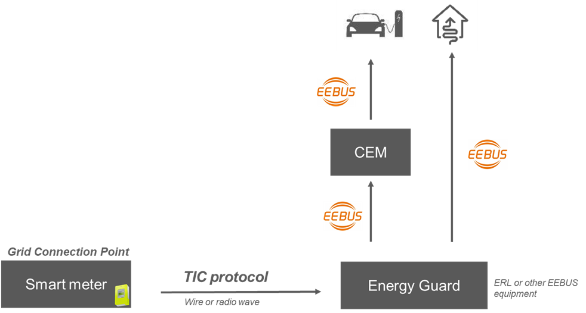

<!--
  ~ Copyright (C) 2025 Enedis Smarties team <dt-dsi-nexus-lab-smarties@enedis.fr>
  ~ 
  ~ SPDX-FileContributor: Jehan BOUSCH
  ~ 
  ~ SPDX-License-Identifier: Apache-2.0
-->

# Vue d'ensemble

## Introduction

L'application **tic4eebus** est utilisée comme gestionnaire d'energie (EnergyGuard dans la documentation EEBUS) utilisant la Télé Information Client (TIC) du compteur Linky comme source de métrologie pour piloter la charge d'un véhicule électrique via une borne de recharge (interface EEBUS).

## Références

### Intégration du compteur Linky

L'intégration d'un compteur Linky dans l'écosystème EEBUS est décrite dans un document disponible [ici](../var/references/Integration-of-the-Linky-Smart-Meter-within-EEBUS-ecosystem.pdf).

### Cas d'utilisation OPEV

Le cas d'utilisation OPEV (Overload Protection by EV Charging Current Curtailment) de la norme EEBUS destiné à empêcher
le déclechement du disjoncteur en amont de l'installation électrique est téléchargeable [ici](../var/references/EEBus_UC_TS_OverloadProtectionByEVChargingCurrentCurtailment_V1.0.1b.pdf).

## Objectif

L'objectif de cette documentation est de fournir les informations nécessaires aux utilisateurs, aux développeurs et aux contributeurs du projet :

- [Configuration](configuration.md)
- [Architecture logicielle](architecture.md)
- [Modèle de données](data_model.md)
